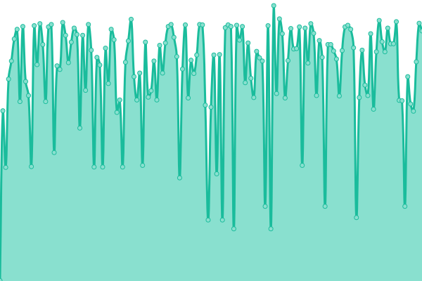
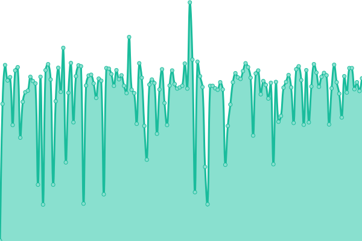
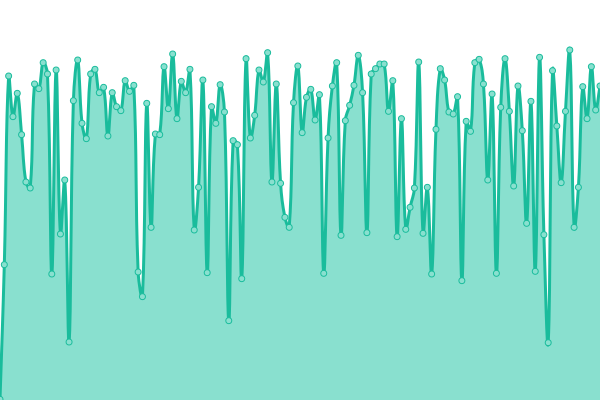
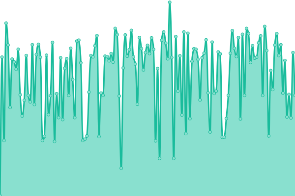
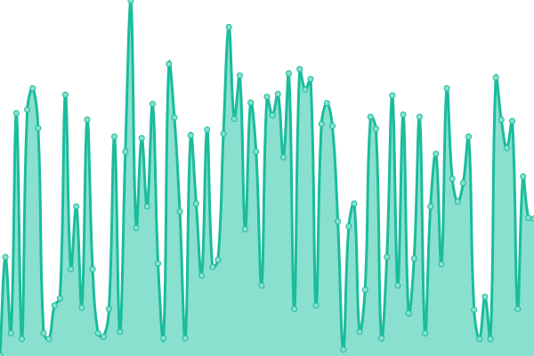
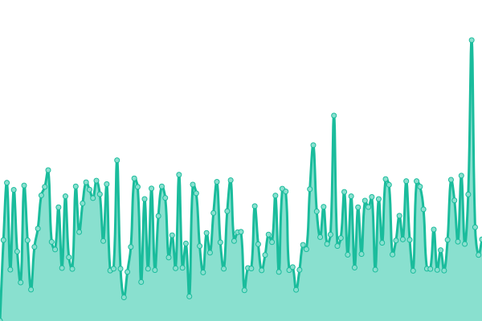
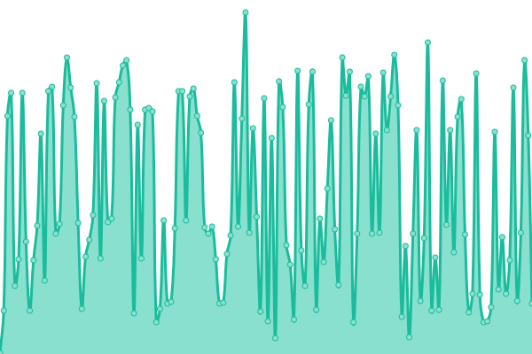
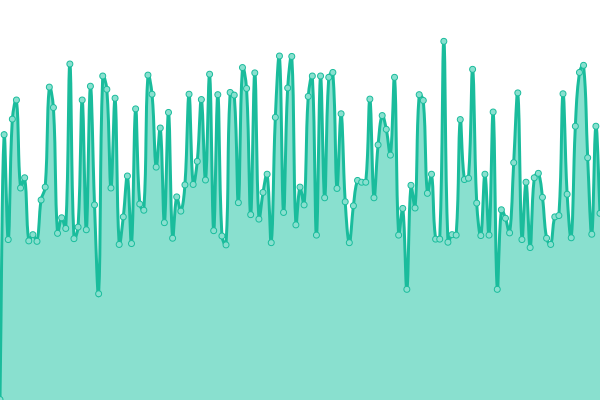
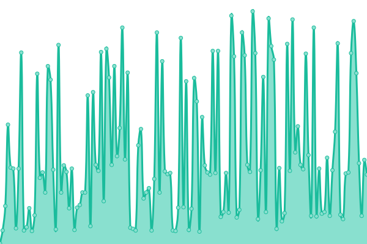
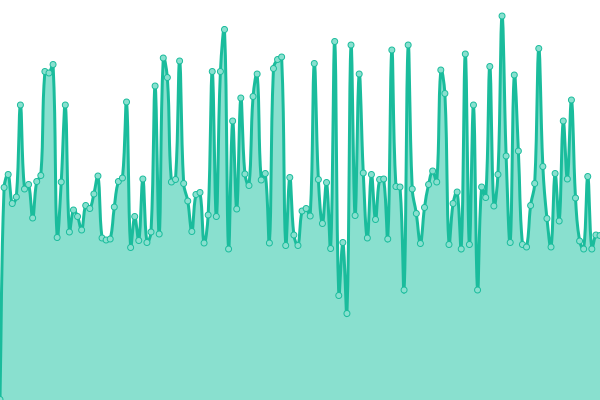

# [📈 Live Status](https://status.yalaso.top): <!--live status--> **🟩 All systems operational**

This repository contains the open-source uptime monitor and status page for [RealYalaSo](https://status.yalaso.top), powered by [Upptime](https://github.com/upptime/upptime).

With [Upptime](https://upptime.js.org), you can get your own unlimited and free uptime monitor and status page, powered entirely by a GitHub repository. We use [Issues](https://github.com/RealYalaSo/status/issues) as incident reports, [Actions](https://github.com/RealYalaSo/status/actions) as uptime monitors, and [Pages](https://status.yalaso.top) for the status page.

<!--start: status pages-->
<!-- This summary is generated by Upptime (https://github.com/upptime/upptime) -->
<!-- Do not edit this manually, your changes will be overwritten -->
<!-- prettier-ignore -->
| URL | Status | History | Response Time | Uptime |
| --- | ------ | ------- | ------------- | ------ |
|  [API](https://api.yalaso.top/api/v1/ping) | 🟩 Up | [api.yml](https://github.com/superrr-vpn/status/commits/HEAD/history/api.yml) | 

 1057ms
     
 | 

<a href="https://status.yalaso.top/history/api">100.00%</a>
    

|  [Node - kr6.yalaso.top](http://kr6.yalaso.top/api/v1/ping) | 🟩 Up | [node-kr6-yalaso-top.yml](https://github.com/superrr-vpn/status/commits/HEAD/history/node-kr6-yalaso-top.yml) | 

 562ms
     
 | 

<a href="https://status.yalaso.top/history/node-kr6-yalaso-top">100.00%</a>
    

|  [Node - ru7.yalaso.top](http://ru7.yalaso.top/api/v1/ping) | 🟩 Up | [node-ru7-yalaso-top.yml](https://github.com/superrr-vpn/status/commits/HEAD/history/node-ru7-yalaso-top.yml) | 

 536ms
     
 | 

<a href="https://status.yalaso.top/history/node-ru7-yalaso-top">97.22%</a>
    

|  [Node - gb7-lincolnshire.yalaso.top](http://gb7-lincolnshire.yalaso.top/api/v1/ping) | 🟩 Up | [node-gb7-lincolnshire-yalaso-top.yml](https://github.com/superrr-vpn/status/commits/HEAD/history/node-gb7-lincolnshire-yalaso-top.yml) | 

 444ms
     
 | 

<a href="https://status.yalaso.top/history/node-gb7-lincolnshire-yalaso-top">89.92%</a>
    

|  [Node - de7-hessen.yalaso.top](http://de7-hessen.yalaso.top/api/v1/ping) | 🟩 Up | [node-de7-hessen-yalaso-top.yml](https://github.com/superrr-vpn/status/commits/HEAD/history/node-de7-hessen-yalaso-top.yml) | 

 429ms
     
 | 

<a href="https://status.yalaso.top/history/node-de7-hessen-yalaso-top">99.45%</a>
    

|  [Node - nl7.yalaso.top](http://nl7.yalaso.top/api/v1/ping) | 🟩 Up | [node-nl7-yalaso-top.yml](https://github.com/superrr-vpn/status/commits/HEAD/history/node-nl7-yalaso-top.yml) | 

 381ms
     
 | 

<a href="https://status.yalaso.top/history/node-nl7-yalaso-top">100.00%</a>
    

|  [Node - us6-la.yalaso.top](http://us6-la.yalaso.top/api/v1/ping) | 🟩 Up | [node-us6-la-yalaso-top.yml](https://github.com/superrr-vpn/status/commits/HEAD/history/node-us6-la-yalaso-top.yml) | 

 211ms
     
 | 

<a href="https://status.yalaso.top/history/node-us6-la-yalaso-top">98.68%</a>
    

|  [Node - jp8.yalaso.top](http://jp8.yalaso.top/api/v1/ping) | 🟩 Up | [node-jp8-yalaso-top.yml](https://github.com/superrr-vpn/status/commits/HEAD/history/node-jp8-yalaso-top.yml) | 

 403ms
     
 | 

<a href="https://status.yalaso.top/history/node-jp8-yalaso-top">97.43%</a>
    

|  [Node - 54360d94.yalaso.top](http://54360d94.yalaso.top/api/v1/ping) | 🟩 Up | [node-54360d94-yalaso-top.yml](https://github.com/superrr-vpn/status/commits/HEAD/history/node-54360d94-yalaso-top.yml) | 

 429ms
     
 | 

<a href="https://status.yalaso.top/history/node-54360d94-yalaso-top">88.72%</a>
    

|  [Node - d880b04a.yalaso.top](http://d880b04a.yalaso.top/api/v1/ping) | 🟩 Up | [node-d880b04a-yalaso-top.yml](https://github.com/superrr-vpn/status/commits/HEAD/history/node-d880b04a-yalaso-top.yml) | 

 167ms
     
 | 

<a href="https://status.yalaso.top/history/node-d880b04a-yalaso-top">98.12%</a>
    

|  [Node - 2d582a2f.yalaso.top](http://2d582a2f.yalaso.top/api/v1/ping) | 🟩 Up | [node-2d582a2f-yalaso-top.yml](https://github.com/superrr-vpn/status/commits/HEAD/history/node-2d582a2f-yalaso-top.yml) | 

 517ms
     
 | 

<a href="https://status.yalaso.top/history/node-2d582a2f-yalaso-top">100.00%</a>
    

|  [Node - us-2d0b03b7.yalaso.top](http://us-2d0b03b7.yalaso.top/api/v1/ping) | 🟩 Up | [node-us-2d0b03b7-yalaso-top.yml](https://github.com/superrr-vpn/status/commits/HEAD/history/node-us-2d0b03b7-yalaso-top.yml) | 

 171ms
     
 | 

<a href="https://status.yalaso.top/history/node-us-2d0b03b7-yalaso-top">99.52%</a>
    

|  [Node - hk-2d88c5eb.yalaso.top](http://hk-2d88c5eb.yalaso.top/api/v1/ping) | 🟩 Up | [node-hk-2d88c5eb-yalaso-top.yml](https://github.com/superrr-vpn/status/commits/HEAD/history/node-hk-2d88c5eb-yalaso-top.yml) | 

 447ms
     
 | 

<a href="https://status.yalaso.top/history/node-hk-2d88c5eb-yalaso-top">100.00%</a>
    

|  [Node - au-b06145ad.yalaso.top](http://au-b06145ad.yalaso.top/api/v1/ping) | 🟩 Up | [node-au-b06145ad-yalaso-top.yml](https://github.com/superrr-vpn/status/commits/HEAD/history/node-au-b06145ad-yalaso-top.yml) | 

 613ms
     
 | 

<a href="https://status.yalaso.top/history/node-au-b06145ad-yalaso-top">100.00%</a>
    

<!--end: status pages-->

[**Visit our status website →**](https://status.yalaso.top)

## 📄 License

- Powered by: [Upptime](https://github.com/upptime/upptime)
- Code: [MIT](./LICENSE) © [RealYalaSo](https://status.yalaso.top)
- Data in the `./history` directory: [Open Database License](https://opendatacommons.org/licenses/odbl/1-0/)
