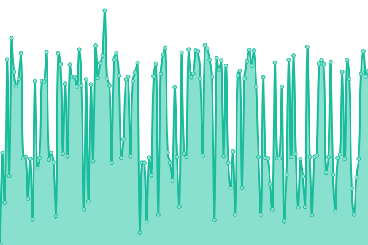
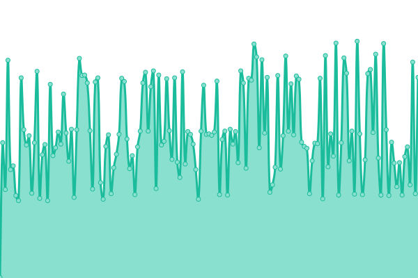
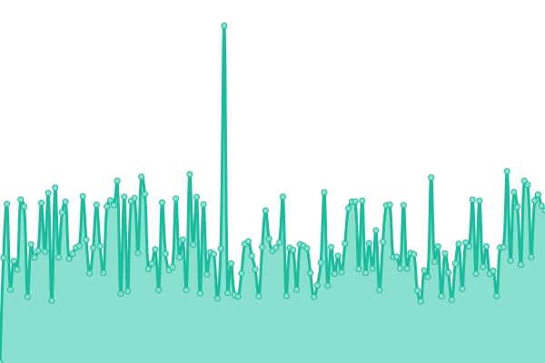
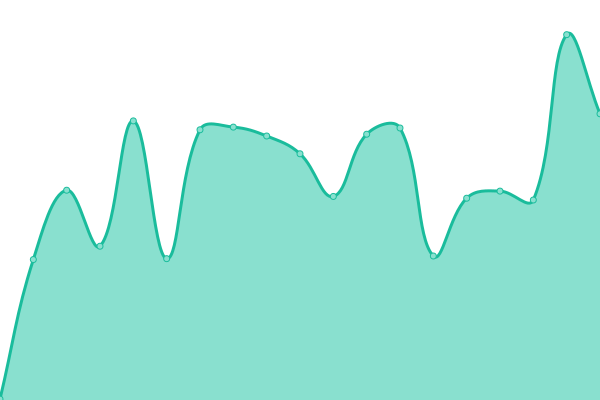
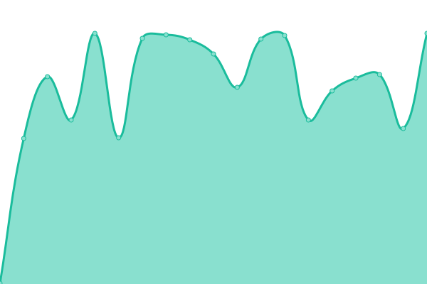
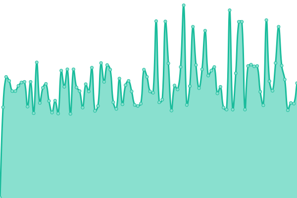
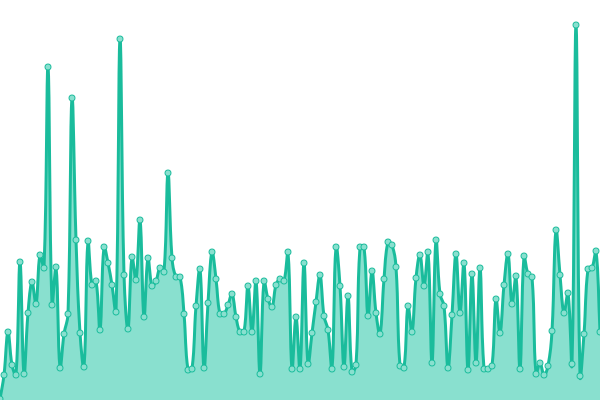

# [📈 Live Status](https://status.yalaso.top): <!--live status--> **🟧 Partial outage**

This repository contains the open-source uptime monitor and status page for [RealYalaSo](https://status.yalaso.top), powered by [Upptime](https://github.com/upptime/upptime).

With [Upptime](https://upptime.js.org), you can get your own unlimited and free uptime monitor and status page, powered entirely by a GitHub repository. We use [Issues](https://github.com/RealYalaSo/status/issues) as incident reports, [Actions](https://github.com/RealYalaSo/status/actions) as uptime monitors, and [Pages](https://status.yalaso.top) for the status page.

<!--start: status pages-->
<!-- This summary is generated by Upptime (https://github.com/upptime/upptime) -->
<!-- Do not edit this manually, your changes will be overwritten -->
<!-- prettier-ignore -->
| URL | Status | History | Response Time | Uptime |
| --- | ------ | ------- | ------------- | ------ |
|  [Yalaso Tech - Home page](https://yalaso.top) | 🟩 Up | [yalaso-tech-home-page.yml](https://github.com/superrr-vpn/status/commits/HEAD/history/yalaso-tech-home-page.yml) | 

 328ms
     
 | 

<a href="https://status.yalaso.top/history/yalaso-tech-home-page">100.00%</a>
    

|  [Turbo Max - Home page old](https://superrr-vpn.yalaso.top) | 🟩 Up | [turbo-max-home-page-old.yml](https://github.com/superrr-vpn/status/commits/HEAD/history/turbo-max-home-page-old.yml) | 

 559ms
     
 | 

<a href="https://status.yalaso.top/history/turbo-max-home-page-old">100.00%</a>
    

|  [Turbo Max - Home page](https://turbo-max.yalaso.top) | 🟩 Up | [turbo-max-home-page.yml](https://github.com/superrr-vpn/status/commits/HEAD/history/turbo-max-home-page.yml) | 

 7ms
     
 | 

<a href="https://status.yalaso.top/history/turbo-max-home-page">100.00%</a>
    

|  [Turbo Max - Subscription](https://turbo-max.yalaso.top/subscriptions.html) | 🟩 Up | [turbo-max-subscription.yml](https://github.com/superrr-vpn/status/commits/HEAD/history/turbo-max-subscription.yml) | 

 52ms
     
 | 

<a href="https://status.yalaso.top/history/turbo-max-subscription">100.00%</a>
    

|  [Turbo Max - Sign in](https://turbo-max.yalaso.top/signin.html) | 🟩 Up | [turbo-max-sign-in.yml](https://github.com/superrr-vpn/status/commits/HEAD/history/turbo-max-sign-in.yml) | 

 0ms
     
 | 

<a href="https://status.yalaso.top/history/turbo-max-sign-in">100.00%</a>
    

|  [Turbo Max - Terms](https://turbo-max.yalaso.top/terms_of_service.html) | 🟩 Up | [turbo-max-terms.yml](https://github.com/superrr-vpn/status/commits/HEAD/history/turbo-max-terms.yml) | 

 51ms
     
 | 

<a href="https://status.yalaso.top/history/turbo-max-terms">100.00%</a>
    

|  [Turbo Max - Policy](https://turbo-max.yalaso.top/policy.html) | 🟩 Up | [turbo-max-policy.yml](https://github.com/superrr-vpn/status/commits/HEAD/history/turbo-max-policy.yml) | 

 54ms
     
 | 

<a href="https://status.yalaso.top/history/turbo-max-policy">100.00%</a>
    

|  [API](https://api.yalaso.top/api/v1/ping) | 🟩 Up | [api.yml](https://github.com/superrr-vpn/status/commits/HEAD/history/api.yml) | 

 1019ms
     
 | 

<a href="https://status.yalaso.top/history/api">100.00%</a>
    

|  [API Auth](https://api.yalaso.top/api/v1/host/auth) | 🟩 Up | [api-auth.yml](https://github.com/superrr-vpn/status/commits/HEAD/history/api-auth.yml) | 

 209ms
     
 | 

<a href="https://status.yalaso.top/history/api-auth">100.00%</a>
    

|  [Node - ae-b061422e.yalaso.top](http://ae-b061422e.yalaso.top/api/v1/ping) | 🟩 Up | [node-ae-b061422e-yalaso-top.yml](https://github.com/superrr-vpn/status/commits/HEAD/history/node-ae-b061422e-yalaso-top.yml) | 

 625ms
     
 | 

<a href="https://status.yalaso.top/history/node-ae-b061422e-yalaso-top">100.00%</a>
    

|  [Node - au-0d374460.yalaso.top](http://au-0d374460.yalaso.top/api/v1/ping) | 🟩 Up | [node-au-0d374460-yalaso-top.yml](https://github.com/superrr-vpn/status/commits/HEAD/history/node-au-0d374460-yalaso-top.yml) | 

 531ms
     
 | 

<a href="https://status.yalaso.top/history/node-au-0d374460-yalaso-top">100.00%</a>
    

|  [Node - au-b06145ad.yalaso.top](http://au-b06145ad.yalaso.top/api/v1/ping) | 🟩 Up | [node-au-b06145ad-yalaso-top.yml](https://github.com/superrr-vpn/status/commits/HEAD/history/node-au-b06145ad-yalaso-top.yml) | 

 545ms
     
 | 

<a href="https://status.yalaso.top/history/node-au-b06145ad-yalaso-top">100.00%</a>
    

|  [Node - ca-23b7569e.yalaso.top](http://ca-23b7569e.yalaso.top/api/v1/ping) | 🟩 Up | [node-ca-23b7569e-yalaso-top.yml](https://github.com/superrr-vpn/status/commits/HEAD/history/node-ca-23b7569e-yalaso-top.yml) | 

 246ms
     
 | 

<a href="https://status.yalaso.top/history/node-ca-23b7569e-yalaso-top">100.00%</a>
    

|  [Node - ca-23b77f40.yalaso.top](http://ca-23b77f40.yalaso.top/api/v1/ping) | 🟩 Up | [node-ca-23b77f40-yalaso-top.yml](https://github.com/superrr-vpn/status/commits/HEAD/history/node-ca-23b77f40-yalaso-top.yml) | 

 221ms
     
 | 

<a href="https://status.yalaso.top/history/node-ca-23b77f40-yalaso-top">100.00%</a>
    

|  [Node - ca-6790b1e9.yalaso.top](http://ca-6790b1e9.yalaso.top/api/v1/ping) | 🟩 Up | [node-ca-6790b1e9-yalaso-top.yml](https://github.com/superrr-vpn/status/commits/HEAD/history/node-ca-6790b1e9-yalaso-top.yml) | 

 194ms
     
 | 

<a href="https://status.yalaso.top/history/node-ca-6790b1e9-yalaso-top">100.00%</a>
    

|  [Node - de-034855ca.yalaso.top](http://de-034855ca.yalaso.top/api/v1/ping) | 🟩 Up | [node-de-034855ca-yalaso-top.yml](https://github.com/superrr-vpn/status/commits/HEAD/history/node-de-034855ca-yalaso-top.yml) | 

 362ms
     
 | 

<a href="https://status.yalaso.top/history/node-de-034855ca-yalaso-top">100.00%</a>
    

|  [Node - de-053d2b7c.yalaso.top](http://de-053d2b7c.yalaso.top/api/v1/ping) | 🟩 Up | [node-de-053d2b7c-yalaso-top.yml](https://github.com/superrr-vpn/status/commits/HEAD/history/node-de-053d2b7c-yalaso-top.yml) | 

 334ms
     
 | 

<a href="https://status.yalaso.top/history/node-de-053d2b7c-yalaso-top">100.00%</a>
    

|  [Node - fr-0d25e231.yalaso.top](http://fr-0d25e231.yalaso.top/api/v1/ping) | 🟩 Up | [node-fr-0d25e231-yalaso-top.yml](https://github.com/superrr-vpn/status/commits/HEAD/history/node-fr-0d25e231-yalaso-top.yml) | 

 326ms
     
 | 

<a href="https://status.yalaso.top/history/node-fr-0d25e231-yalaso-top">100.00%</a>
    

|  [Node - fr-0d261edf.yalaso.top](http://fr-0d261edf.yalaso.top/api/v1/ping) | 🟩 Up | [node-fr-0d261edf-yalaso-top.yml](https://github.com/superrr-vpn/status/commits/HEAD/history/node-fr-0d261edf-yalaso-top.yml) | 

 309ms
     
 | 

<a href="https://status.yalaso.top/history/node-fr-0d261edf-yalaso-top">100.00%</a>
    

|  [Node - fr-ace82ecd.yalaso.top](http://fr-ace82ecd.yalaso.top/api/v1/ping) | 🟩 Up | [node-fr-ace82ecd-yalaso-top.yml](https://github.com/superrr-vpn/status/commits/HEAD/history/node-fr-ace82ecd-yalaso-top.yml) | 

 330ms
     
 | 

<a href="https://status.yalaso.top/history/node-fr-ace82ecd-yalaso-top">100.00%</a>
    

|  [Node - gb-03087f26.yalaso.top](http://gb-03087f26.yalaso.top/api/v1/ping) | 🟩 Up | [node-gb-03087f26-yalaso-top.yml](https://github.com/superrr-vpn/status/commits/HEAD/history/node-gb-03087f26-yalaso-top.yml) | 

 294ms
     
 | 

<a href="https://status.yalaso.top/history/node-gb-03087f26-yalaso-top">100.00%</a>
    

|  [Node - gb-053d3db7.yalaso.top](http://gb-053d3db7.yalaso.top/api/v1/ping) | 🟩 Up | [node-gb-053d3db7-yalaso-top.yml](https://github.com/superrr-vpn/status/commits/HEAD/history/node-gb-053d3db7-yalaso-top.yml) | 

 295ms
     
 | 

<a href="https://status.yalaso.top/history/node-gb-053d3db7-yalaso-top">100.00%</a>
    

|  [Node - gb-8b1ccf30.yalaso.top](http://gb-8b1ccf30.yalaso.top/api/v1/ping) | 🟩 Up | [node-gb-8b1ccf30-yalaso-top.yml](https://github.com/superrr-vpn/status/commits/HEAD/history/node-gb-8b1ccf30-yalaso-top.yml) | 

 302ms
     
 | 

<a href="https://status.yalaso.top/history/node-gb-8b1ccf30-yalaso-top">100.00%</a>
    

|  [Node - gb-b03a6504.yalaso.top](http://gb-b03a6504.yalaso.top/api/v1/ping) | 🟩 Up | [node-gb-b03a6504-yalaso-top.yml](https://github.com/superrr-vpn/status/commits/HEAD/history/node-gb-b03a6504-yalaso-top.yml) | 

 275ms
     
 | 

<a href="https://status.yalaso.top/history/node-gb-b03a6504-yalaso-top">100.00%</a>
    

|  [Node - gb-b9b3d80f.yalaso.top](http://gb-b9b3d80f.yalaso.top/api/v1/ping) | 🟩 Up | [node-gb-b9b3d80f-yalaso-top.yml](https://github.com/superrr-vpn/status/commits/HEAD/history/node-gb-b9b3d80f-yalaso-top.yml) | 

 380ms
     
 | 

<a href="https://status.yalaso.top/history/node-gb-b9b3d80f-yalaso-top">100.00%</a>
    

|  [Node - ie-34d3f93e.yalaso.top](http://ie-34d3f93e.yalaso.top/api/v1/ping) | 🟩 Up | [node-ie-34d3f93e-yalaso-top.yml](https://github.com/superrr-vpn/status/commits/HEAD/history/node-ie-34d3f93e-yalaso-top.yml) | 

 248ms
     
 | 

<a href="https://status.yalaso.top/history/node-ie-34d3f93e-yalaso-top">100.00%</a>
    

|  [Node - in-344234fc.yalaso.top](http://in-344234fc.yalaso.top/api/v1/ping) | 🟩 Up | [node-in-344234fc-yalaso-top.yml](https://github.com/superrr-vpn/status/commits/HEAD/history/node-in-344234fc-yalaso-top.yml) | 

 506ms
     
 | 

<a href="https://status.yalaso.top/history/node-in-344234fc-yalaso-top">100.00%</a>
    

|  [Node - jp-12b5d967.yalaso.top](http://jp-12b5d967.yalaso.top/api/v1/ping) | 🟩 Up | [node-jp-12b5d967-yalaso-top.yml](https://github.com/superrr-vpn/status/commits/HEAD/history/node-jp-12b5d967-yalaso-top.yml) | 

 330ms
     
 | 

<a href="https://status.yalaso.top/history/node-jp-12b5d967-yalaso-top">100.00%</a>
    

|  [Node - jp-2bcfaff7.yalaso.top](http://jp-2bcfaff7.yalaso.top/api/v1/ping) | 🟩 Up | [node-jp-2bcfaff7-yalaso-top.yml](https://github.com/superrr-vpn/status/commits/HEAD/history/node-jp-2bcfaff7-yalaso-top.yml) | 

 312ms
     
 | 

<a href="https://status.yalaso.top/history/node-jp-2bcfaff7-yalaso-top">100.00%</a>
    

|  [Node - kr-0d7c7a1d.yalaso.top](http://kr-0d7c7a1d.yalaso.top/api/v1/ping) | 🟩 Up | [node-kr-0d7c7a1d-yalaso-top.yml](https://github.com/superrr-vpn/status/commits/HEAD/history/node-kr-0d7c7a1d-yalaso-top.yml) | 

 384ms
     
 | 

<a href="https://status.yalaso.top/history/node-kr-0d7c7a1d-yalaso-top">100.00%</a>
    

|  [Node - nl-bc7417b6.yalaso.top](http://nl-bc7417b6.yalaso.top/api/v1/ping) | 🟩 Up | [node-nl-bc7417b6-yalaso-top.yml](https://github.com/superrr-vpn/status/commits/HEAD/history/node-nl-bc7417b6-yalaso-top.yml) | 

 262ms
     
 | 

<a href="https://status.yalaso.top/history/node-nl-bc7417b6-yalaso-top">100.00%</a>
    

|  [Node - ru-2d59e4d7.yalaso.top](http://ru-2d59e4d7.yalaso.top/api/v1/ping) | 🟩 Up | [node-ru-2d59e4d7-yalaso-top.yml](https://github.com/superrr-vpn/status/commits/HEAD/history/node-ru-2d59e4d7-yalaso-top.yml) | 

 514ms
     
 | 

<a href="https://status.yalaso.top/history/node-ru-2d59e4d7-yalaso-top">100.00%</a>
    

|  [Node - ru-2d8102a9.yalaso.top](http://ru-2d8102a9.yalaso.top/api/v1/ping) | 🟩 Up | [node-ru-2d8102a9-yalaso-top.yml](https://github.com/superrr-vpn/status/commits/HEAD/history/node-ru-2d8102a9-yalaso-top.yml) | 

 395ms
     
 | 

<a href="https://status.yalaso.top/history/node-ru-2d8102a9-yalaso-top">100.00%</a>
    

|  [Node - ru-b90442ee.yalaso.top](http://ru-b90442ee.yalaso.top/api/v1/ping) | 🟩 Up | [node-ru-b90442ee-yalaso-top.yml](https://github.com/superrr-vpn/status/commits/HEAD/history/node-ru-b90442ee-yalaso-top.yml) | 

 392ms
     
 | 

<a href="https://status.yalaso.top/history/node-ru-b90442ee-yalaso-top">100.00%</a>
    

|  [Node - ru-b9044395.yalaso.top](http://ru-b9044395.yalaso.top/api/v1/ping) | 🟩 Up | [node-ru-b9044395-yalaso-top.yml](https://github.com/superrr-vpn/status/commits/HEAD/history/node-ru-b9044395-yalaso-top.yml) | 

 343ms
     
 | 

<a href="https://status.yalaso.top/history/node-ru-b9044395-yalaso-top">100.00%</a>
    

|  [Node - ru-c257457d.yalaso.top](http://ru-c257457d.yalaso.top/api/v1/ping) | 🟩 Up | [node-ru-c257457d-yalaso-top.yml](https://github.com/superrr-vpn/status/commits/HEAD/history/node-ru-c257457d-yalaso-top.yml) | 

 329ms
     
 | 

<a href="https://status.yalaso.top/history/node-ru-c257457d-yalaso-top">100.00%</a>
    

|  [Node - se-0d33a168.yalaso.top](http://se-0d33a168.yalaso.top/api/v1/ping) | 🟩 Up | [node-se-0d33a168-yalaso-top.yml](https://github.com/superrr-vpn/status/commits/HEAD/history/node-se-0d33a168-yalaso-top.yml) | 

 296ms
     
 | 

<a href="https://status.yalaso.top/history/node-se-0d33a168-yalaso-top">100.00%</a>
    

|  [Node - se-ace8928e.yalaso.top](http://se-ace8928e.yalaso.top/api/v1/ping) | 🟩 Up | [node-se-ace8928e-yalaso-top.yml](https://github.com/superrr-vpn/status/commits/HEAD/history/node-se-ace8928e-yalaso-top.yml) | 

 284ms
     
 | 

<a href="https://status.yalaso.top/history/node-se-ace8928e-yalaso-top">99.78%</a>
    

|  [Node - sg-36a9833d.yalaso.top](http://sg-36a9833d.yalaso.top/api/v1/ping) | 🟩 Up | [node-sg-36a9833d-yalaso-top.yml](https://github.com/superrr-vpn/status/commits/HEAD/history/node-sg-36a9833d-yalaso-top.yml) | 

 432ms
     
 | 

<a href="https://status.yalaso.top/history/node-sg-36a9833d-yalaso-top">100.00%</a>
    

|  [Node - sg-36a983c6.yalaso.top](http://sg-36a983c6.yalaso.top/api/v1/ping) | 🟩 Up | [node-sg-36a983c6-yalaso-top.yml](https://github.com/superrr-vpn/status/commits/HEAD/history/node-sg-36a983c6-yalaso-top.yml) | 

 438ms
     
 | 

<a href="https://status.yalaso.top/history/node-sg-36a983c6-yalaso-top">100.00%</a>
    

|  [Node - sg-36fff2ee.yalaso.top](http://sg-36fff2ee.yalaso.top/api/v1/ping) | 🟩 Up | [node-sg-36fff2ee-yalaso-top.yml](https://github.com/superrr-vpn/status/commits/HEAD/history/node-sg-36fff2ee-yalaso-top.yml) | 

 430ms
     
 | 

<a href="https://status.yalaso.top/history/node-sg-36fff2ee-yalaso-top">100.00%</a>
    

|  [Node - tr-b062292a.yalaso.top](http://tr-b062292a.yalaso.top/api/v1/ping) | 🟥 Down | [node-tr-b062292a-yalaso-top.yml](https://github.com/superrr-vpn/status/commits/HEAD/history/node-tr-b062292a-yalaso-top.yml) | 

 338ms
     
 | 

<a href="https://status.yalaso.top/history/node-tr-b062292a-yalaso-top">99.87%</a>
    

|  [Node - ua-8200ea14.yalaso.top](http://ua-8200ea14.yalaso.top/api/v1/ping) | 🟩 Up | [node-ua-8200ea14-yalaso-top.yml](https://github.com/superrr-vpn/status/commits/HEAD/history/node-ua-8200ea14-yalaso-top.yml) | 

 314ms
     
 | 

<a href="https://status.yalaso.top/history/node-ua-8200ea14-yalaso-top">100.00%</a>
    

|  [Node - us-03511e7f.yalaso.top](http://us-03511e7f.yalaso.top/api/v1/ping) | 🟩 Up | [node-us-03511e7f-yalaso-top.yml](https://github.com/superrr-vpn/status/commits/HEAD/history/node-us-03511e7f-yalaso-top.yml) | 

 92ms
     
 | 

<a href="https://status.yalaso.top/history/node-us-03511e7f-yalaso-top">100.00%</a>
    

|  [Node - us-12dac159.yalaso.top](http://us-12dac159.yalaso.top/api/v1/ping) | 🟩 Up | [node-us-12dac159-yalaso-top.yml](https://github.com/superrr-vpn/status/commits/HEAD/history/node-us-12dac159-yalaso-top.yml) | 

 99ms
     
 | 

<a href="https://status.yalaso.top/history/node-us-12dac159-yalaso-top">99.78%</a>
    

|  [Node - us-22d02de8.yalaso.top](http://us-22d02de8.yalaso.top/api/v1/ping) | 🟩 Up | [node-us-22d02de8-yalaso-top.yml](https://github.com/superrr-vpn/status/commits/HEAD/history/node-us-22d02de8-yalaso-top.yml) | 

 136ms
     
 | 

<a href="https://status.yalaso.top/history/node-us-22d02de8-yalaso-top">99.79%</a>
    

|  [Node - us-235b1104.yalaso.top](http://us-235b1104.yalaso.top/api/v1/ping) | 🟩 Up | [node-us-235b1104-yalaso-top.yml](https://github.com/superrr-vpn/status/commits/HEAD/history/node-us-235b1104-yalaso-top.yml) | 

 138ms
     
 | 

<a href="https://status.yalaso.top/history/node-us-235b1104-yalaso-top">100.00%</a>
    

|  [Node - us-2501d3cc.yalaso.top](http://us-2501d3cc.yalaso.top/api/v1/ping) | 🟩 Up | [node-us-2501d3cc-yalaso-top.yml](https://github.com/superrr-vpn/status/commits/HEAD/history/node-us-2501d3cc-yalaso-top.yml) | 

 113ms
     
 | 

<a href="https://status.yalaso.top/history/node-us-2501d3cc-yalaso-top">47.13%</a>
    

|  [Node - us-2656834a.yalaso.top](http://us-2656834a.yalaso.top/api/v1/ping) | 🟩 Up | [node-us-2656834a-yalaso-top.yml](https://github.com/superrr-vpn/status/commits/HEAD/history/node-us-2656834a-yalaso-top.yml) | 

 112ms
     
 | 

<a href="https://status.yalaso.top/history/node-us-2656834a-yalaso-top">100.00%</a>
    

|  [Node - us-2d410907.yalaso.top](http://us-2d410907.yalaso.top/api/v1/ping) | 🟩 Up | [node-us-2d410907-yalaso-top.yml](https://github.com/superrr-vpn/status/commits/HEAD/history/node-us-2d410907-yalaso-top.yml) | 

 101ms
     
 | 

<a href="https://status.yalaso.top/history/node-us-2d410907-yalaso-top">99.79%</a>
    

|  [Node - us-2e159fc1.yalaso.top](http://us-2e159fc1.yalaso.top/api/v1/ping) | 🟩 Up | [node-us-2e159fc1-yalaso-top.yml](https://github.com/superrr-vpn/status/commits/HEAD/history/node-us-2e159fc1-yalaso-top.yml) | 

 240ms
     
 | 

<a href="https://status.yalaso.top/history/node-us-2e159fc1-yalaso-top">99.79%</a>
    

|  [Node - us-5c26a98c.yalaso.top](http://us-5c26a98c.yalaso.top/api/v1/ping) | 🟩 Up | [node-us-5c26a98c-yalaso-top.yml](https://github.com/superrr-vpn/status/commits/HEAD/history/node-us-5c26a98c-yalaso-top.yml) | 

 93ms
     
 | 

<a href="https://status.yalaso.top/history/node-us-5c26a98c-yalaso-top">100.00%</a>
    

|  [Node - us-8f2ab690.yalaso.top](http://us-8f2ab690.yalaso.top/api/v1/ping) | 🟩 Up | [node-us-8f2ab690-yalaso-top.yml](https://github.com/superrr-vpn/status/commits/HEAD/history/node-us-8f2ab690-yalaso-top.yml) | 

 100ms
     
 | 

<a href="https://status.yalaso.top/history/node-us-8f2ab690-yalaso-top">100.00%</a>
    

|  [Node - us-acea10fc.yalaso.top](http://us-acea10fc.yalaso.top/api/v1/ping) | 🟩 Up | [node-us-acea10fc-yalaso-top.yml](https://github.com/superrr-vpn/status/commits/HEAD/history/node-us-acea10fc-yalaso-top.yml) | 

 82ms
     
 | 

<a href="https://status.yalaso.top/history/node-us-acea10fc-yalaso-top">100.00%</a>
    

|  [Node - us-acea2bad.yalaso.top](http://us-acea2bad.yalaso.top/api/v1/ping) | 🟩 Up | [node-us-acea2bad-yalaso-top.yml](https://github.com/superrr-vpn/status/commits/HEAD/history/node-us-acea2bad-yalaso-top.yml) | 

 87ms
     
 | 

<a href="https://status.yalaso.top/history/node-us-acea2bad-yalaso-top">100.00%</a>
    

<!--end: status pages-->

[**Visit our status website →**](https://status.yalaso.top)

## 📄 License

- Powered by: [Upptime](https://github.com/upptime/upptime)
- Code: [MIT](./LICENSE) © [RealYalaSo](https://status.yalaso.top)
- Data in the `./history` directory: [Open Database License](https://opendatacommons.org/licenses/odbl/1-0/)
