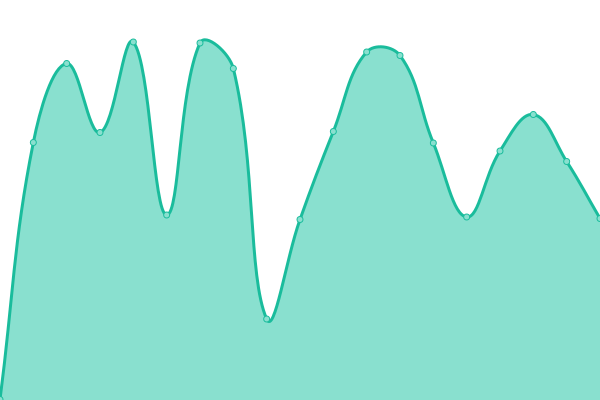
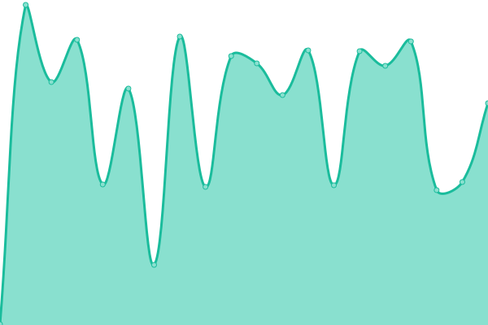
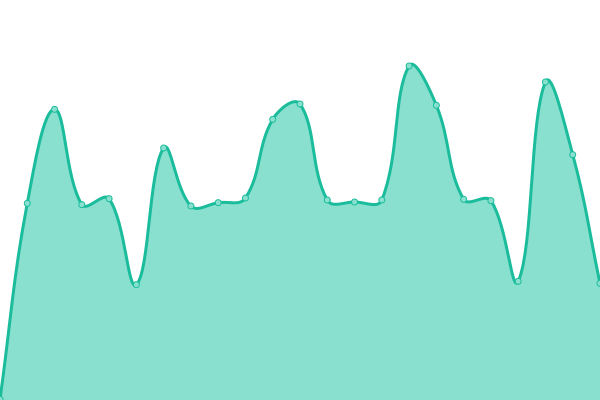
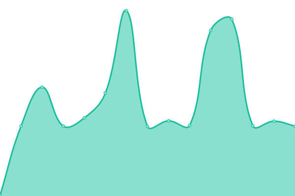
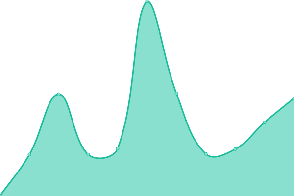
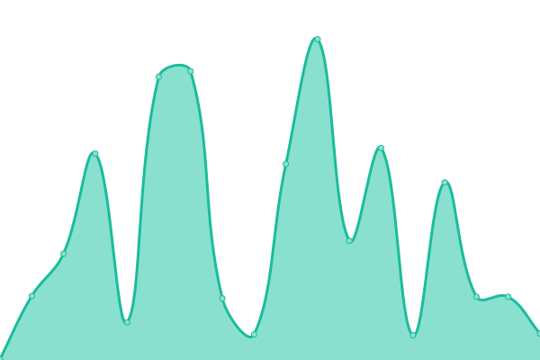

# [📈 Live Status](https://status.yalaso.top): <!--live status--> **🟩 All systems operational**

This repository contains the open-source uptime monitor and status page for [RealYalaSo](https://status.yalaso.top), powered by [Upptime](https://github.com/upptime/upptime).

With [Upptime](https://upptime.js.org), you can get your own unlimited and free uptime monitor and status page, powered entirely by a GitHub repository. We use [Issues](https://github.com/RealYalaSo/status/issues) as incident reports, [Actions](https://github.com/RealYalaSo/status/actions) as uptime monitors, and [Pages](https://status.yalaso.top) for the status page.

<!--start: status pages-->
<!-- This summary is generated by Upptime (https://github.com/upptime/upptime) -->
<!-- Do not edit this manually, your changes will be overwritten -->
<!-- prettier-ignore -->
| URL | Status | History | Response Time | Uptime |
| --- | ------ | ------- | ------------- | ------ |
|  [API](https://api.yalaso.top/api/v1/ping) | 🟩 Up | [api.yml](https://github.com/RealYalaSo/status/commits/HEAD/history/api.yml) | 

 1022ms
     
 | 

<a href="https://status.yalaso.top/history/api">100.00%</a>
    

|  [Node - sg1](http://sg1.yalaso.top/api/v1/ping) | 🟩 Up | [node-sg1.yml](https://github.com/RealYalaSo/status/commits/HEAD/history/node-sg1.yml) | 

 562ms
     
 | 

<a href="https://status.yalaso.top/history/node-sg1">100.00%</a>
    

|  [Node - ca2](http://ca2.yalaso.top/api/v1/ping) | 🟩 Up | [node-ca2.yml](https://github.com/RealYalaSo/status/commits/HEAD/history/node-ca2.yml) | 

 304ms
     
 | 

<a href="https://status.yalaso.top/history/node-ca2">100.00%</a>
    

|  [Node - de2](http://de2.yalaso.top/api/v1/ping) | 🟩 Up | [node-de2.yml](https://github.com/RealYalaSo/status/commits/HEAD/history/node-de2.yml) | 

 395ms
     
 | 

<a href="https://status.yalaso.top/history/node-de2">100.00%</a>
    

|  [Node - gb2](http://gb2.yalaso.top/api/v1/ping) | 🟩 Up | [node-gb2.yml](https://github.com/RealYalaSo/status/commits/HEAD/history/node-gb2.yml) | 

 332ms
     
 | 

<a href="https://status.yalaso.top/history/node-gb2">100.00%</a>
    

|  [Node - jp2](http://jp2.yalaso.top/api/v1/ping) | 🟩 Up | [node-jp2.yml](https://github.com/RealYalaSo/status/commits/HEAD/history/node-jp2.yml) | 

 250ms
     
 | 

<a href="https://status.yalaso.top/history/node-jp2">100.00%</a>
    

|  [Node - kr2](http://kr2.yalaso.top/api/v1/ping) | 🟩 Up | [node-kr2.yml](https://github.com/RealYalaSo/status/commits/HEAD/history/node-kr2.yml) | 

 355ms
     
 | 

<a href="https://status.yalaso.top/history/node-kr2">100.00%</a>
    

|  [Node - us2](http://us2.yalaso.top/api/v1/ping) | 🟩 Up | [node-us2.yml](https://github.com/RealYalaSo/status/commits/HEAD/history/node-us2.yml) | 

 130ms
     
 | 

<a href="https://status.yalaso.top/history/node-us2">100.00%</a>
    

<!--end: status pages-->

[**Visit our status website →**](https://status.yalaso.top)

## 📄 License

- Powered by: [Upptime](https://github.com/upptime/upptime)
- Code: [MIT](./LICENSE) © [RealYalaSo](https://status.yalaso.top)
- Data in the `./history` directory: [Open Database License](https://opendatacommons.org/licenses/odbl/1-0/)
