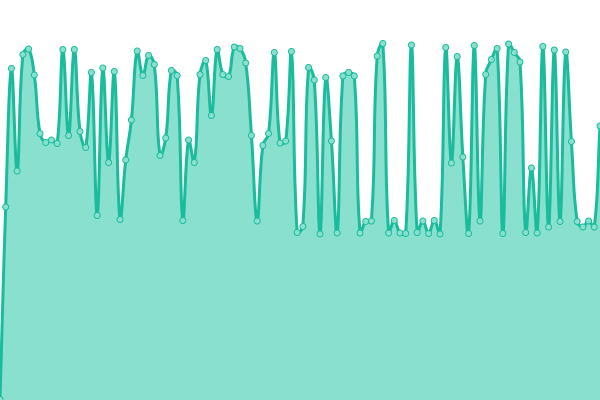
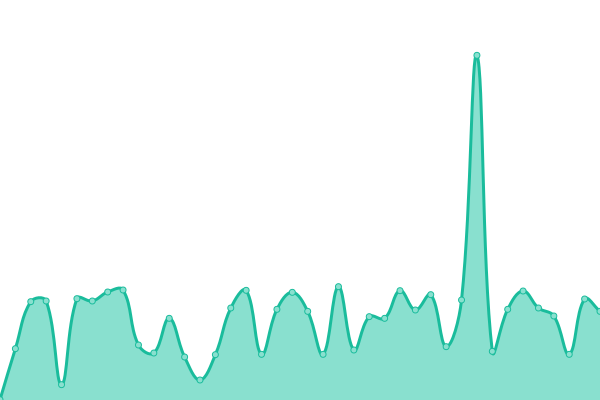
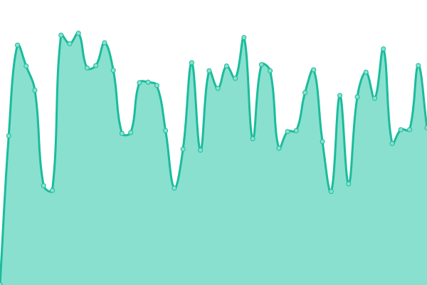
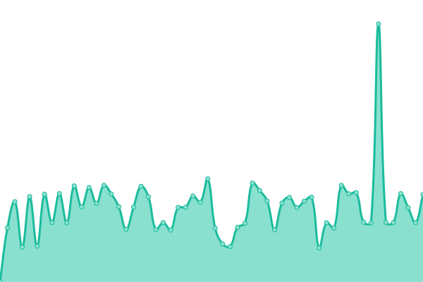
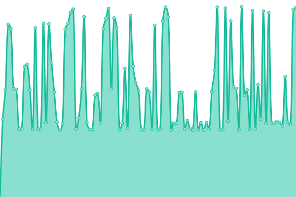
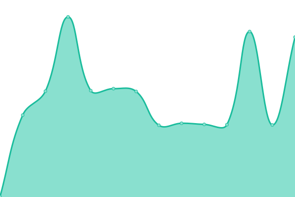
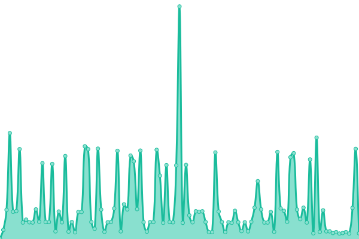

# [📈 Live Status](https://status.yalaso.top): <!--live status--> **🟩 All systems operational**

This repository contains the open-source uptime monitor and status page for [RealYalaSo](https://status.yalaso.top), powered by [Upptime](https://github.com/upptime/upptime).

With [Upptime](https://upptime.js.org), you can get your own unlimited and free uptime monitor and status page, powered entirely by a GitHub repository. We use [Issues](https://github.com/RealYalaSo/status/issues) as incident reports, [Actions](https://github.com/RealYalaSo/status/actions) as uptime monitors, and [Pages](https://status.yalaso.top) for the status page.

<!--start: status pages-->
<!-- This summary is generated by Upptime (https://github.com/upptime/upptime) -->
<!-- Do not edit this manually, your changes will be overwritten -->
<!-- prettier-ignore -->
| URL | Status | History | Response Time | Uptime |
| --- | ------ | ------- | ------------- | ------ |
|  [API](https://api.yalaso.top/api/v1/ping) | 🟩 Up | [api.yml](https://github.com/RealYalaSo/status/commits/HEAD/history/api.yml) | 

 997ms
     
 | 

<a href="https://status.yalaso.top/history/api">100.00%</a>
    

|  [Node - sg3](http://sg3.yalaso.top/api/v1/ping) | 🟩 Up | [node-sg3.yml](https://github.com/RealYalaSo/status/commits/HEAD/history/node-sg3.yml) | 

 547ms
     
 | 

<a href="https://status.yalaso.top/history/node-sg3">100.00%</a>
    

|  [Node - ca3](http://ca3.yalaso.top/api/v1/ping) | 🟩 Up | [node-ca3.yml](https://github.com/RealYalaSo/status/commits/HEAD/history/node-ca3.yml) | 

 264ms
     
 | 

<a href="https://status.yalaso.top/history/node-ca3">100.00%</a>
    

|  [Node - de3](http://de3.yalaso.top/api/v1/ping) | 🟩 Up | [node-de3.yml](https://github.com/RealYalaSo/status/commits/HEAD/history/node-de3.yml) | 

 373ms
     
 | 

<a href="https://status.yalaso.top/history/node-de3">100.00%</a>
    

|  [Node - gb3](http://gb3.yalaso.top/api/v1/ping) | 🟩 Up | [node-gb3.yml](https://github.com/RealYalaSo/status/commits/HEAD/history/node-gb3.yml) | 

 354ms
     
 | 

<a href="https://status.yalaso.top/history/node-gb3">100.00%</a>
    

|  [Node - jp3](http://jp3.yalaso.top/api/v1/ping) | 🟩 Up | [node-jp3.yml](https://github.com/RealYalaSo/status/commits/HEAD/history/node-jp3.yml) | 

 338ms
     
 | 

<a href="https://status.yalaso.top/history/node-jp3">100.00%</a>
    

|  [Node - kr3](http://kr3.yalaso.top/api/v1/ping) | 🟩 Up | [node-kr3.yml](https://github.com/RealYalaSo/status/commits/HEAD/history/node-kr3.yml) | 

 393ms
     
 | 

<a href="https://status.yalaso.top/history/node-kr3">100.00%</a>
    

|  [Node - us3](http://us3.yalaso.top/api/v1/ping) | 🟩 Up | [node-us3.yml](https://github.com/RealYalaSo/status/commits/HEAD/history/node-us3.yml) | 

 154ms
     
 | 

<a href="https://status.yalaso.top/history/node-us3">100.00%</a>
    

<!--end: status pages-->

[**Visit our status website →**](https://status.yalaso.top)

## 📄 License

- Powered by: [Upptime](https://github.com/upptime/upptime)
- Code: [MIT](./LICENSE) © [RealYalaSo](https://status.yalaso.top)
- Data in the `./history` directory: [Open Database License](https://opendatacommons.org/licenses/odbl/1-0/)
