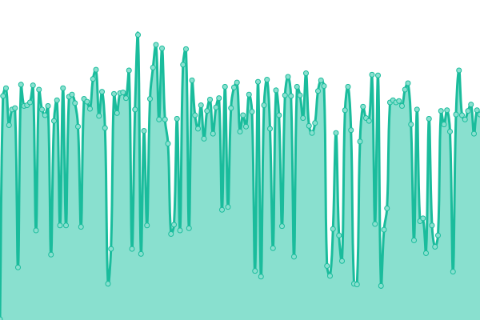

# [📈 Live Status](https://status.yalaso.top): <!--live status--> **🟩 All systems operational**

This repository contains the open-source uptime monitor and status page for [RealYalaSo](https://status.yalaso.top), powered by [Upptime](https://github.com/upptime/upptime).

With [Upptime](https://upptime.js.org), you can get your own unlimited and free uptime monitor and status page, powered entirely by a GitHub repository. We use [Issues](https://github.com/RealYalaSo/status/issues) as incident reports, [Actions](https://github.com/RealYalaSo/status/actions) as uptime monitors, and [Pages](https://status.yalaso.top) for the status page.

<!--start: status pages-->
<!-- This summary is generated by Upptime (https://github.com/upptime/upptime) -->
<!-- Do not edit this manually, your changes will be overwritten -->
<!-- prettier-ignore -->
| URL | Status | History | Response Time | Uptime |
| --- | ------ | ------- | ------------- | ------ |
|  [API](https://api.yalaso.top/api/v1/ping) | 🟩 Up | [api.yml](https://github.com/superrr-vpn/status/commits/HEAD/history/api.yml) | 

 1067ms
     
 | 

<a href="https://status.yalaso.top/history/api">100.00%</a>
    

|  [API Auth](https://api.yalaso.top/api/v1/host/auth) | 🟩 Up | [api-auth.yml](https://github.com/superrr-vpn/status/commits/HEAD/history/api-auth.yml) | 

 244ms
     
 | 

<a href="https://status.yalaso.top/history/api-auth">100.00%</a>
    

|  [Node - 54360d94.yalaso.top](http://54360d94.yalaso.top/api/v1/ping) | 🟩 Up | [node-54360d94-yalaso-top.yml](https://github.com/superrr-vpn/status/commits/HEAD/history/node-54360d94-yalaso-top.yml) | 

 546ms
     
 | 

<a href="https://status.yalaso.top/history/node-54360d94-yalaso-top">98.43%</a>
    

|  [Node - ae-b0614281.yalaso.top](http://ae-b0614281.yalaso.top/api/v1/ping) | 🟩 Up | [node-ae-b0614281-yalaso-top.yml](https://github.com/superrr-vpn/status/commits/HEAD/history/node-ae-b0614281-yalaso-top.yml) | 

 652ms
     
 | 

<a href="https://status.yalaso.top/history/node-ae-b0614281-yalaso-top">94.60%</a>
    

|  [Node - au-b06145ad.yalaso.top](http://au-b06145ad.yalaso.top/api/v1/ping) | 🟩 Up | [node-au-b06145ad-yalaso-top.yml](https://github.com/superrr-vpn/status/commits/HEAD/history/node-au-b06145ad-yalaso-top.yml) | 

 737ms
     
 | 

<a href="https://status.yalaso.top/history/node-au-b06145ad-yalaso-top">98.67%</a>
    

|  [Node - ca-6790b1e9.yalaso.top](http://ca-6790b1e9.yalaso.top/api/v1/ping) | 🟩 Up | [node-ca-6790b1e9-yalaso-top.yml](https://github.com/superrr-vpn/status/commits/HEAD/history/node-ca-6790b1e9-yalaso-top.yml) | 

 296ms
     
 | 

<a href="https://status.yalaso.top/history/node-ca-6790b1e9-yalaso-top">9.87%</a>
    

|  [Node - ca-68a67f36.yalaso.top](http://ca-68a67f36.yalaso.top/api/v1/ping) | 🟩 Up | [node-ca-68a67f36-yalaso-top.yml](https://github.com/superrr-vpn/status/commits/HEAD/history/node-ca-68a67f36-yalaso-top.yml) | 

 241ms
     
 | 

<a href="https://status.yalaso.top/history/node-ca-68a67f36-yalaso-top">92.97%</a>
    

|  [Node - ch-b32bb087.yalaso.top](http://ch-b32bb087.yalaso.top/api/v1/ping) | 🟩 Up | [node-ch-b32bb087-yalaso-top.yml](https://github.com/superrr-vpn/status/commits/HEAD/history/node-ch-b32bb087-yalaso-top.yml) | 

 389ms
     
 | 

<a href="https://status.yalaso.top/history/node-ch-b32bb087-yalaso-top">98.53%</a>
    

|  [Node - de-053d2451.yalaso.top](http://de-053d2451.yalaso.top/api/v1/ping) | 🟩 Up | [node-de-053d2451-yalaso-top.yml](https://github.com/superrr-vpn/status/commits/HEAD/history/node-de-053d2451-yalaso-top.yml) | 

 376ms
     
 | 

<a href="https://status.yalaso.top/history/node-de-053d2451-yalaso-top">93.47%</a>
    

|  [Node - fr-b9579728.yalaso.top](http://fr-b9579728.yalaso.top/api/v1/ping) | 🟩 Up | [node-fr-b9579728-yalaso-top.yml](https://github.com/superrr-vpn/status/commits/HEAD/history/node-fr-b9579728-yalaso-top.yml) | 

 348ms
     
 | 

<a href="https://status.yalaso.top/history/node-fr-b9579728-yalaso-top">88.39%</a>
    

|  [Node - gb-053d3db7.yalaso.top](http://gb-053d3db7.yalaso.top/api/v1/ping) | 🟩 Up | [node-gb-053d3db7-yalaso-top.yml](https://github.com/superrr-vpn/status/commits/HEAD/history/node-gb-053d3db7-yalaso-top.yml) | 

 334ms
     
 | 

<a href="https://status.yalaso.top/history/node-gb-053d3db7-yalaso-top">98.54%</a>
    

|  [Node - gb7-lincolnshire.yalaso.top](http://gb7-lincolnshire.yalaso.top/api/v1/ping) | 🟩 Up | [node-gb7-lincolnshire-yalaso-top.yml](https://github.com/superrr-vpn/status/commits/HEAD/history/node-gb7-lincolnshire-yalaso-top.yml) | 

 330ms
     
 | 

<a href="https://status.yalaso.top/history/node-gb7-lincolnshire-yalaso-top">98.27%</a>
    

|  [Node - hk-2d88c5eb.yalaso.top](http://hk-2d88c5eb.yalaso.top/api/v1/ping) | 🟩 Up | [node-hk-2d88c5eb-yalaso-top.yml](https://github.com/superrr-vpn/status/commits/HEAD/history/node-hk-2d88c5eb-yalaso-top.yml) | 

 519ms
     
 | 

<a href="https://status.yalaso.top/history/node-hk-2d88c5eb-yalaso-top">98.96%</a>
    

|  [Node - jp-b0614696.yalaso.top](http://jp-b0614696.yalaso.top/api/v1/ping) | 🟩 Up | [node-jp-b0614696-yalaso-top.yml](https://github.com/superrr-vpn/status/commits/HEAD/history/node-jp-b0614696-yalaso-top.yml) | 

 366ms
     
 | 

<a href="https://status.yalaso.top/history/node-jp-b0614696-yalaso-top">98.54%</a>
    

|  [Node - kr-8da426e6.yalaso.top](http://kr-8da426e6.yalaso.top/api/v1/ping) | 🟩 Up | [node-kr-8da426e6-yalaso-top.yml](https://github.com/superrr-vpn/status/commits/HEAD/history/node-kr-8da426e6-yalaso-top.yml) | 

 418ms
     
 | 

<a href="https://status.yalaso.top/history/node-kr-8da426e6-yalaso-top">100.00%</a>
    

|  [Node - nl-2501cb1d.yalaso.top](http://nl-2501cb1d.yalaso.top/api/v1/ping) | 🟩 Up | [node-nl-2501cb1d-yalaso-top.yml](https://github.com/superrr-vpn/status/commits/HEAD/history/node-nl-2501cb1d-yalaso-top.yml) | 

 288ms
     
 | 

<a href="https://status.yalaso.top/history/node-nl-2501cb1d-yalaso-top">90.71%</a>
    

|  [Node - ru-5bc1b64c.yalaso.top](http://ru-5bc1b64c.yalaso.top/api/v1/ping) | 🟩 Up | [node-ru-5bc1b64c-yalaso-top.yml](https://github.com/superrr-vpn/status/commits/HEAD/history/node-ru-5bc1b64c-yalaso-top.yml) | 

 361ms
     
 | 

<a href="https://status.yalaso.top/history/node-ru-5bc1b64c-yalaso-top">95.31%</a>
    

|  [Node - sg-67539fc1.yalaso.top](http://sg-67539fc1.yalaso.top/api/v1/ping) | 🟩 Up | [node-sg-67539fc1-yalaso-top.yml](https://github.com/superrr-vpn/status/commits/HEAD/history/node-sg-67539fc1-yalaso-top.yml) | 

 475ms
     
 | 

<a href="https://status.yalaso.top/history/node-sg-67539fc1-yalaso-top">100.00%</a>
    

|  [Node - us-2501d3f2.yalaso.top](http://us-2501d3f2.yalaso.top/api/v1/ping) | 🟩 Up | [node-us-2501d3f2-yalaso-top.yml](https://github.com/superrr-vpn/status/commits/HEAD/history/node-us-2501d3f2-yalaso-top.yml) | 

 131ms
     
 | 

<a href="https://status.yalaso.top/history/node-us-2501d3f2-yalaso-top">95.67%</a>
    

|  [Node - us-2656834a.yalaso.top](http://us-2656834a.yalaso.top/api/v1/ping) | 🟩 Up | [node-us-2656834a-yalaso-top.yml](https://github.com/superrr-vpn/status/commits/HEAD/history/node-us-2656834a-yalaso-top.yml) | 

 158ms
     
 | 

<a href="https://status.yalaso.top/history/node-us-2656834a-yalaso-top">100.00%</a>
    

|  [Node - us-95ff2449.yalaso.top](http://us-95ff2449.yalaso.top/api/v1/ping) | 🟩 Up | [node-us-95ff2449-yalaso-top.yml](https://github.com/superrr-vpn/status/commits/HEAD/history/node-us-95ff2449-yalaso-top.yml) | 

 162ms
     
 | 

<a href="https://status.yalaso.top/history/node-us-95ff2449-yalaso-top">93.69%</a>
    

<!--end: status pages-->

[**Visit our status website →**](https://status.yalaso.top)

## 📄 License

- Powered by: [Upptime](https://github.com/upptime/upptime)
- Code: [MIT](./LICENSE) © [RealYalaSo](https://status.yalaso.top)
- Data in the `./history` directory: [Open Database License](https://opendatacommons.org/licenses/odbl/1-0/)
