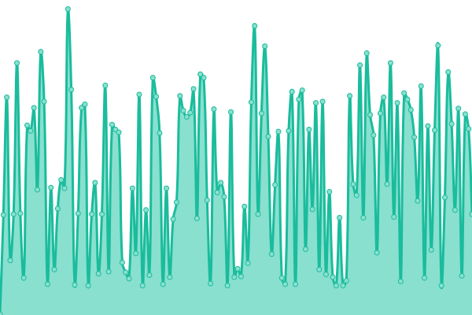
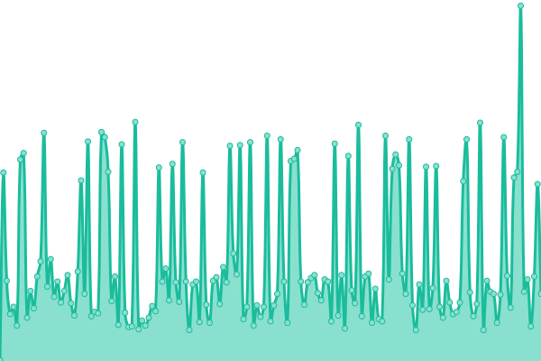

# [📈 Live Status](https://status.yalaso.top): <!--live status--> **🟩 All systems operational**

This repository contains the open-source uptime monitor and status page for [RealYalaSo](https://status.yalaso.top), powered by [Upptime](https://github.com/upptime/upptime).

With [Upptime](https://upptime.js.org), you can get your own unlimited and free uptime monitor and status page, powered entirely by a GitHub repository. We use [Issues](https://github.com/RealYalaSo/status/issues) as incident reports, [Actions](https://github.com/RealYalaSo/status/actions) as uptime monitors, and [Pages](https://status.yalaso.top) for the status page.

<!--start: status pages-->
<!-- This summary is generated by Upptime (https://github.com/upptime/upptime) -->
<!-- Do not edit this manually, your changes will be overwritten -->
<!-- prettier-ignore -->
| URL | Status | History | Response Time | Uptime |
| --- | ------ | ------- | ------------- | ------ |
|  [API](https://api.yalaso.top/api/v1/ping) | 🟩 Up | [api.yml](https://github.com/superrr-vpn/status/commits/HEAD/history/api.yml) | 

 1039ms
     
 | 

<a href="https://status.yalaso.top/history/api">100.00%</a>
    

|  [Node - kr6.yalaso.top](http://kr6.yalaso.top/api/v1/ping) | 🟩 Up | [node-kr6-yalaso-top.yml](https://github.com/superrr-vpn/status/commits/HEAD/history/node-kr6-yalaso-top.yml) | 

 549ms
     
 | 

<a href="https://status.yalaso.top/history/node-kr6-yalaso-top">100.00%</a>
    

|  [Node - gb7-lincolnshire.yalaso.top](http://gb7-lincolnshire.yalaso.top/api/v1/ping) | 🟩 Up | [node-gb7-lincolnshire-yalaso-top.yml](https://github.com/superrr-vpn/status/commits/HEAD/history/node-gb7-lincolnshire-yalaso-top.yml) | 

 435ms
     
 | 

<a href="https://status.yalaso.top/history/node-gb7-lincolnshire-yalaso-top">83.20%</a>
    

|  [Node - jp8.yalaso.top](http://jp8.yalaso.top/api/v1/ping) | 🟩 Up | [node-jp8-yalaso-top.yml](https://github.com/superrr-vpn/status/commits/HEAD/history/node-jp8-yalaso-top.yml) | 

 499ms
     
 | 

<a href="https://status.yalaso.top/history/node-jp8-yalaso-top">100.00%</a>
    

|  [Node - 54360d94.yalaso.top](http://54360d94.yalaso.top/api/v1/ping) | 🟩 Up | [node-54360d94-yalaso-top.yml](https://github.com/superrr-vpn/status/commits/HEAD/history/node-54360d94-yalaso-top.yml) | 

 499ms
     
 | 

<a href="https://status.yalaso.top/history/node-54360d94-yalaso-top">100.00%</a>
    

|  [Node - 2d582a2f.yalaso.top](http://2d582a2f.yalaso.top/api/v1/ping) | 🟩 Up | [node-2d582a2f-yalaso-top.yml](https://github.com/superrr-vpn/status/commits/HEAD/history/node-2d582a2f-yalaso-top.yml) | 

 583ms
     
 | 

<a href="https://status.yalaso.top/history/node-2d582a2f-yalaso-top">100.00%</a>
    

|  [Node - us-2d0b03b7.yalaso.top](http://us-2d0b03b7.yalaso.top/api/v1/ping) | 🟩 Up | [node-us-2d0b03b7-yalaso-top.yml](https://github.com/superrr-vpn/status/commits/HEAD/history/node-us-2d0b03b7-yalaso-top.yml) | 

 272ms
     
 | 

<a href="https://status.yalaso.top/history/node-us-2d0b03b7-yalaso-top">98.94%</a>
    

|  [Node - hk-2d88c5eb.yalaso.top](http://hk-2d88c5eb.yalaso.top/api/v1/ping) | 🟩 Up | [node-hk-2d88c5eb-yalaso-top.yml](https://github.com/superrr-vpn/status/commits/HEAD/history/node-hk-2d88c5eb-yalaso-top.yml) | 

 539ms
     
 | 

<a href="https://status.yalaso.top/history/node-hk-2d88c5eb-yalaso-top">100.00%</a>
    

|  [Node - au-b06145ad.yalaso.top](http://au-b06145ad.yalaso.top/api/v1/ping) | 🟩 Up | [node-au-b06145ad-yalaso-top.yml](https://github.com/superrr-vpn/status/commits/HEAD/history/node-au-b06145ad-yalaso-top.yml) | 

 658ms
     
 | 

<a href="https://status.yalaso.top/history/node-au-b06145ad-yalaso-top">100.00%</a>
    

|  [Node - ca-9e450b89.yalaso.top](http://ca-9e450b89.yalaso.top/api/v1/ping) | 🟩 Up | [node-ca-9e450b89-yalaso-top.yml](https://github.com/superrr-vpn/status/commits/HEAD/history/node-ca-9e450b89-yalaso-top.yml) | 

 218ms
     
 | 

<a href="https://status.yalaso.top/history/node-ca-9e450b89-yalaso-top">51.30%</a>
    

|  [Node - ca-6790b1e9.yalaso.top](http://ca-6790b1e9.yalaso.top/api/v1/ping) | 🟩 Up | [node-ca-6790b1e9-yalaso-top.yml](https://github.com/superrr-vpn/status/commits/HEAD/history/node-ca-6790b1e9-yalaso-top.yml) | 

 175ms
     
 | 

<a href="https://status.yalaso.top/history/node-ca-6790b1e9-yalaso-top">100.00%</a>
    

|  [Node - nl-2501cb1d.yalaso.top](http://nl-2501cb1d.yalaso.top/api/v1/ping) | 🟩 Up | [node-nl-2501cb1d-yalaso-top.yml](https://github.com/superrr-vpn/status/commits/HEAD/history/node-nl-2501cb1d-yalaso-top.yml) | 

 323ms
     
 | 

<a href="https://status.yalaso.top/history/node-nl-2501cb1d-yalaso-top">86.72%</a>
    

|  [Node - ae-b0614281.yalaso.top](http://ae-b0614281.yalaso.top/api/v1/ping) | 🟩 Up | [node-ae-b0614281-yalaso-top.yml](https://github.com/superrr-vpn/status/commits/HEAD/history/node-ae-b0614281-yalaso-top.yml) | 

 528ms
     
 | 

<a href="https://status.yalaso.top/history/node-ae-b0614281-yalaso-top">98.98%</a>
    

|  [Node - us-2501d3f2.yalaso.top](http://us-2501d3f2.yalaso.top/api/v1/ping) | 🟩 Up | [node-us-2501d3f2-yalaso-top.yml](https://github.com/superrr-vpn/status/commits/HEAD/history/node-us-2501d3f2-yalaso-top.yml) | 

 161ms
     
 | 

<a href="https://status.yalaso.top/history/node-us-2501d3f2-yalaso-top">98.98%</a>
    

|  [Node - ru-5bc1b64c.yalaso.top](http://ru-5bc1b64c.yalaso.top/api/v1/ping) | 🟩 Up | [node-ru-5bc1b64c-yalaso-top.yml](https://github.com/superrr-vpn/status/commits/HEAD/history/node-ru-5bc1b64c-yalaso-top.yml) | 

 375ms
     
 | 

<a href="https://status.yalaso.top/history/node-ru-5bc1b64c-yalaso-top">98.98%</a>
    

|  [Node - de-053d2451.yalaso.top](http://de-053d2451.yalaso.top/api/v1/ping) | 🟩 Up | [node-de-053d2451-yalaso-top.yml](https://github.com/superrr-vpn/status/commits/HEAD/history/node-de-053d2451-yalaso-top.yml) | 

 312ms
     
 | 

<a href="https://status.yalaso.top/history/node-de-053d2451-yalaso-top">87.22%</a>
    

<!--end: status pages-->

[**Visit our status website →**](https://status.yalaso.top)

## 📄 License

- Powered by: [Upptime](https://github.com/upptime/upptime)
- Code: [MIT](./LICENSE) © [RealYalaSo](https://status.yalaso.top)
- Data in the `./history` directory: [Open Database License](https://opendatacommons.org/licenses/odbl/1-0/)
