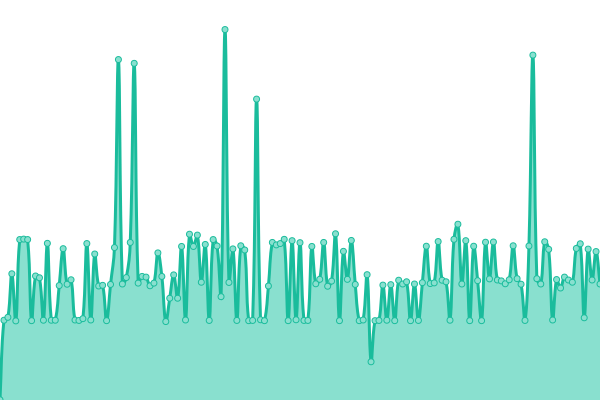
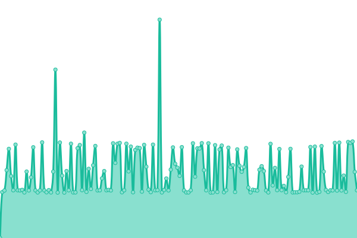
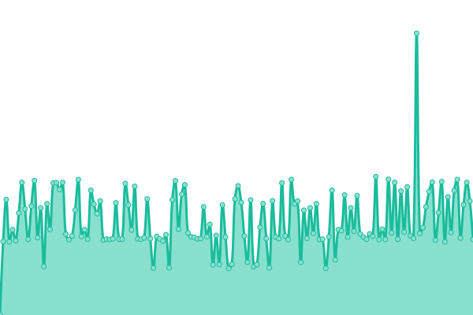
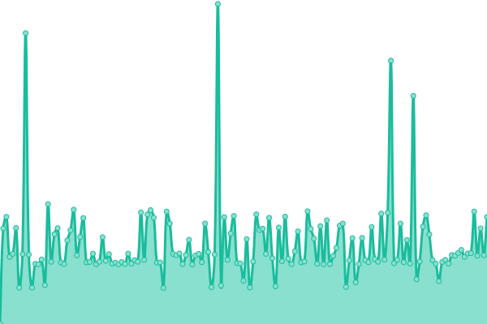
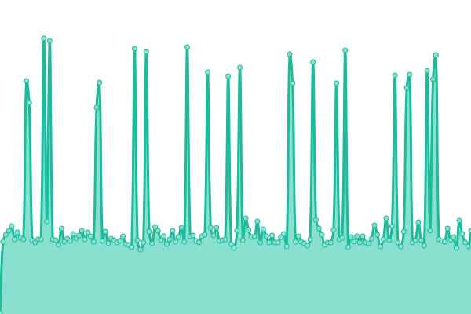

# [📈 Live Status](https://status.yalaso.top): <!--live status--> **🟩 All systems operational**

This repository contains the open-source uptime monitor and status page for [RealYalaSo](https://status.yalaso.top), powered by [Upptime](https://github.com/upptime/upptime).

With [Upptime](https://upptime.js.org), you can get your own unlimited and free uptime monitor and status page, powered entirely by a GitHub repository. We use [Issues](https://github.com/RealYalaSo/status/issues) as incident reports, [Actions](https://github.com/RealYalaSo/status/actions) as uptime monitors, and [Pages](https://status.yalaso.top) for the status page.

<!--start: status pages-->
<!-- This summary is generated by Upptime (https://github.com/upptime/upptime) -->
<!-- Do not edit this manually, your changes will be overwritten -->
<!-- prettier-ignore -->
| URL | Status | History | Response Time | Uptime |
| --- | ------ | ------- | ------------- | ------ |
|  [API](https://api.yalaso.top/api/v1/ping) | 🟩 Up | [api.yml](https://github.com/superrr-vpn/status/commits/HEAD/history/api.yml) | 

 1008ms
     
 | 

<a href="https://status.yalaso.top/history/api">100.00%</a>
    

|  [Node - sg5](http://sg5.yalaso.top/api/v1/ping) | 🟩 Up | [node-sg5.yml](https://github.com/superrr-vpn/status/commits/HEAD/history/node-sg5.yml) | 

 549ms
     
 | 

<a href="https://status.yalaso.top/history/node-sg5">100.00%</a>
    

|  [Node - sg6](http://sg6.yalaso.top/api/v1/ping) | 🟩 Up | [node-sg6.yml](https://github.com/superrr-vpn/status/commits/HEAD/history/node-sg6.yml) | 

 505ms
     
 | 

<a href="https://status.yalaso.top/history/node-sg6">100.00%</a>
    

|  [Node - ca6](http://ca6.yalaso.top/api/v1/ping) | 🟩 Up | [node-ca6.yml](https://github.com/superrr-vpn/status/commits/HEAD/history/node-ca6.yml) | 

 230ms
     
 | 

<a href="https://status.yalaso.top/history/node-ca6">100.00%</a>
    

|  [Node - de6](http://de6.yalaso.top/api/v1/ping) | 🟩 Up | [node-de6.yml](https://github.com/superrr-vpn/status/commits/HEAD/history/node-de6.yml) | 

 367ms
     
 | 

<a href="https://status.yalaso.top/history/node-de6">100.00%</a>
    

|  [Node - gb6](http://gb6.yalaso.top/api/v1/ping) | 🟩 Up | [node-gb6.yml](https://github.com/superrr-vpn/status/commits/HEAD/history/node-gb6.yml) | 

 315ms
     
 | 

<a href="https://status.yalaso.top/history/node-gb6">100.00%</a>
    

|  [Node - jp6](http://jp6.yalaso.top/api/v1/ping) | 🟩 Up | [node-jp6.yml](https://github.com/superrr-vpn/status/commits/HEAD/history/node-jp6.yml) | 

 316ms
     
 | 

<a href="https://status.yalaso.top/history/node-jp6">100.00%</a>
    

|  [Node - kr6](http://kr6.yalaso.top/api/v1/ping) | 🟩 Up | [node-kr6.yml](https://github.com/superrr-vpn/status/commits/HEAD/history/node-kr6.yml) | 

 343ms
     
 | 

<a href="https://status.yalaso.top/history/node-kr6">100.00%</a>
    

|  [Node - us6](http://us6.yalaso.top/api/v1/ping) | 🟩 Up | [node-us6.yml](https://github.com/superrr-vpn/status/commits/HEAD/history/node-us6.yml) | 

 84ms
     
 | 

<a href="https://status.yalaso.top/history/node-us6">44.71%</a>
    

|  [Node - us6-fremont](http://us6-fremont.yalaso.top/api/v1/ping) | 🟩 Up | [node-us6-fremont.yml](https://github.com/superrr-vpn/status/commits/HEAD/history/node-us6-fremont.yml) | 

 91ms
     
 | 

<a href="https://status.yalaso.top/history/node-us6-fremont">100.00%</a>
    

|  [Node - us6-dallas](http://us6-dallas.yalaso.top/api/v1/ping) | 🟩 Up | [node-us6-dallas.yml](https://github.com/superrr-vpn/status/commits/HEAD/history/node-us6-dallas.yml) | 

 135ms
     
 | 

<a href="https://status.yalaso.top/history/node-us6-dallas">100.00%</a>
    

|  [Node - nl6](http://nl6.yalaso.top/api/v1/ping) | 🟩 Up | [node-nl6.yml](https://github.com/superrr-vpn/status/commits/HEAD/history/node-nl6.yml) | 

 307ms
     
 | 

<a href="https://status.yalaso.top/history/node-nl6">100.00%</a>
    

|  [Node - au6](http://au6.yalaso.top/api/v1/ping) | 🟩 Up | [node-au6.yml](https://github.com/superrr-vpn/status/commits/HEAD/history/node-au6.yml) | 

 360ms
     
 | 

<a href="https://status.yalaso.top/history/node-au6">100.00%</a>
    

<!--end: status pages-->

[**Visit our status website →**](https://status.yalaso.top)

## 📄 License

- Powered by: [Upptime](https://github.com/upptime/upptime)
- Code: [MIT](./LICENSE) © [RealYalaSo](https://status.yalaso.top)
- Data in the `./history` directory: [Open Database License](https://opendatacommons.org/licenses/odbl/1-0/)
