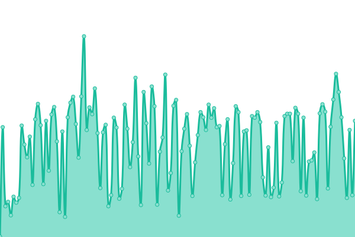

# [📈 Live Status](https://status.yalaso.top): <!--live status--> **🟩 All systems operational**

This repository contains the open-source uptime monitor and status page for [RealYalaSo](https://status.yalaso.top), powered by [Upptime](https://github.com/upptime/upptime).

With [Upptime](https://upptime.js.org), you can get your own unlimited and free uptime monitor and status page, powered entirely by a GitHub repository. We use [Issues](https://github.com/RealYalaSo/status/issues) as incident reports, [Actions](https://github.com/RealYalaSo/status/actions) as uptime monitors, and [Pages](https://status.yalaso.top) for the status page.

<!--start: status pages-->
<!-- This summary is generated by Upptime (https://github.com/upptime/upptime) -->
<!-- Do not edit this manually, your changes will be overwritten -->
<!-- prettier-ignore -->
| URL | Status | History | Response Time | Uptime |
| --- | ------ | ------- | ------------- | ------ |
|  [Yalaso Tech - Home page](https://yalaso.top) | 🟩 Up | [yalaso-tech-home-page.yml](https://github.com/superrr-vpn/status/commits/HEAD/history/yalaso-tech-home-page.yml) | 

 317ms
     
 | 

<a href="https://status.yalaso.top/history/yalaso-tech-home-page">98.53%</a>
    

|  [Turbo Max - Home page old](https://superrr-vpn.yalaso.top) | 🟩 Up | [turbo-max-home-page-old.yml](https://github.com/superrr-vpn/status/commits/HEAD/history/turbo-max-home-page-old.yml) | 

 603ms
     
 | 

<a href="https://status.yalaso.top/history/turbo-max-home-page-old">100.00%</a>
    

|  [Turbo Max - Home page](https://turbo-max.yalaso.top) | 🟩 Up | [turbo-max-home-page.yml](https://github.com/superrr-vpn/status/commits/HEAD/history/turbo-max-home-page.yml) | 

 107ms
     
 | 

<a href="https://status.yalaso.top/history/turbo-max-home-page">100.00%</a>
    

|  [Turbo Max - Subscription](https://turbo-max.yalaso.top/subscriptions.html) | 🟩 Up | [turbo-max-subscription.yml](https://github.com/superrr-vpn/status/commits/HEAD/history/turbo-max-subscription.yml) | 

 44ms
     
 | 

<a href="https://status.yalaso.top/history/turbo-max-subscription">100.00%</a>
    

|  [Turbo Max - Sign in](https://turbo-max.yalaso.top/signin.html) | 🟩 Up | [turbo-max-sign-in.yml](https://github.com/superrr-vpn/status/commits/HEAD/history/turbo-max-sign-in.yml) | 

 0ms
     
 | 

<a href="https://status.yalaso.top/history/turbo-max-sign-in">100.00%</a>
    

|  [Turbo Max - Terms](https://turbo-max.yalaso.top/terms_of_service.html) | 🟩 Up | [turbo-max-terms.yml](https://github.com/superrr-vpn/status/commits/HEAD/history/turbo-max-terms.yml) | 

 42ms
     
 | 

<a href="https://status.yalaso.top/history/turbo-max-terms">100.00%</a>
    

|  [Turbo Max - Policy](https://turbo-max.yalaso.top/policy.html) | 🟩 Up | [turbo-max-policy.yml](https://github.com/superrr-vpn/status/commits/HEAD/history/turbo-max-policy.yml) | 

 42ms
     
 | 

<a href="https://status.yalaso.top/history/turbo-max-policy">100.00%</a>
    

|  [API](https://api.yalaso.top/api/v1/ping) | 🟩 Up | [api.yml](https://github.com/superrr-vpn/status/commits/HEAD/history/api.yml) | 

 1052ms
     
 | 

<a href="https://status.yalaso.top/history/api">100.00%</a>
    

|  [API Auth](https://api.yalaso.top/api/v1/host/auth) | 🟩 Up | [api-auth.yml](https://github.com/superrr-vpn/status/commits/HEAD/history/api-auth.yml) | 

 208ms
     
 | 

<a href="https://status.yalaso.top/history/api-auth">100.00%</a>
    

|  [Node - ae-b061422e.yalaso.top](http://ae-b061422e.yalaso.top/api/v1/ping) | 🟩 Up | [node-ae-b061422e-yalaso-top.yml](https://github.com/superrr-vpn/status/commits/HEAD/history/node-ae-b061422e-yalaso-top.yml) | 

 640ms
     
 | 

<a href="https://status.yalaso.top/history/node-ae-b061422e-yalaso-top">100.00%</a>
    

|  [Node - au-0d374460.yalaso.top](http://au-0d374460.yalaso.top/api/v1/ping) | 🟩 Up | [node-au-0d374460-yalaso-top.yml](https://github.com/superrr-vpn/status/commits/HEAD/history/node-au-0d374460-yalaso-top.yml) | 

 545ms
     
 | 

<a href="https://status.yalaso.top/history/node-au-0d374460-yalaso-top">100.00%</a>
    

|  [Node - au-b06145ad.yalaso.top](http://au-b06145ad.yalaso.top/api/v1/ping) | 🟩 Up | [node-au-b06145ad-yalaso-top.yml](https://github.com/superrr-vpn/status/commits/HEAD/history/node-au-b06145ad-yalaso-top.yml) | 

 573ms
     
 | 

<a href="https://status.yalaso.top/history/node-au-b06145ad-yalaso-top">100.00%</a>
    

|  [Node - ca-179a516e.yalaso.top](http://ca-179a516e.yalaso.top/api/v1/ping) | 🟩 Up | [node-ca-179a516e-yalaso-top.yml](https://github.com/superrr-vpn/status/commits/HEAD/history/node-ca-179a516e-yalaso-top.yml) | 

 277ms
     
 | 

<a href="https://status.yalaso.top/history/node-ca-179a516e-yalaso-top">100.00%</a>
    

|  [Node - ca-23b77f40.yalaso.top](http://ca-23b77f40.yalaso.top/api/v1/ping) | 🟩 Up | [node-ca-23b77f40-yalaso-top.yml](https://github.com/superrr-vpn/status/commits/HEAD/history/node-ca-23b77f40-yalaso-top.yml) | 

 233ms
     
 | 

<a href="https://status.yalaso.top/history/node-ca-23b77f40-yalaso-top">100.00%</a>
    

|  [Node - ca-6790b1e9.yalaso.top](http://ca-6790b1e9.yalaso.top/api/v1/ping) | 🟩 Up | [node-ca-6790b1e9-yalaso-top.yml](https://github.com/superrr-vpn/status/commits/HEAD/history/node-ca-6790b1e9-yalaso-top.yml) | 

 209ms
     
 | 

<a href="https://status.yalaso.top/history/node-ca-6790b1e9-yalaso-top">100.00%</a>
    

|  [Node - ch-b32bb087.yalaso.top](http://ch-b32bb087.yalaso.top/api/v1/ping) | 🟩 Up | [node-ch-b32bb087-yalaso-top.yml](https://github.com/superrr-vpn/status/commits/HEAD/history/node-ch-b32bb087-yalaso-top.yml) | 

 374ms
     
 | 

<a href="https://status.yalaso.top/history/node-ch-b32bb087-yalaso-top">99.78%</a>
    

|  [Node - de-034855ca.yalaso.top](http://de-034855ca.yalaso.top/api/v1/ping) | 🟩 Up | [node-de-034855ca-yalaso-top.yml](https://github.com/superrr-vpn/status/commits/HEAD/history/node-de-034855ca-yalaso-top.yml) | 

 354ms
     
 | 

<a href="https://status.yalaso.top/history/node-de-034855ca-yalaso-top">98.44%</a>
    

|  [Node - de-053d2b7c.yalaso.top](http://de-053d2b7c.yalaso.top/api/v1/ping) | 🟩 Up | [node-de-053d2b7c-yalaso-top.yml](https://github.com/superrr-vpn/status/commits/HEAD/history/node-de-053d2b7c-yalaso-top.yml) | 

 338ms
     
 | 

<a href="https://status.yalaso.top/history/node-de-053d2b7c-yalaso-top">100.00%</a>
    

|  [Node - de-2d9e0997.yalaso.top](http://de-2d9e0997.yalaso.top/api/v1/ping) | 🟩 Up | [node-de-2d9e0997-yalaso-top.yml](https://github.com/superrr-vpn/status/commits/HEAD/history/node-de-2d9e0997-yalaso-top.yml) | 

 334ms
     
 | 

<a href="https://status.yalaso.top/history/node-de-2d9e0997-yalaso-top">100.00%</a>
    

|  [Node - fr-0d261edf.yalaso.top](http://fr-0d261edf.yalaso.top/api/v1/ping) | 🟩 Up | [node-fr-0d261edf-yalaso-top.yml](https://github.com/superrr-vpn/status/commits/HEAD/history/node-fr-0d261edf-yalaso-top.yml) | 

 309ms
     
 | 

<a href="https://status.yalaso.top/history/node-fr-0d261edf-yalaso-top">100.00%</a>
    

|  [Node - fr-b9579728.yalaso.top](http://fr-b9579728.yalaso.top/api/v1/ping) | 🟩 Up | [node-fr-b9579728-yalaso-top.yml](https://github.com/superrr-vpn/status/commits/HEAD/history/node-fr-b9579728-yalaso-top.yml) | 

 328ms
     
 | 

<a href="https://status.yalaso.top/history/node-fr-b9579728-yalaso-top">100.00%</a>
    

|  [Node - gb-03087f26.yalaso.top](http://gb-03087f26.yalaso.top/api/v1/ping) | 🟩 Up | [node-gb-03087f26-yalaso-top.yml](https://github.com/superrr-vpn/status/commits/HEAD/history/node-gb-03087f26-yalaso-top.yml) | 

 291ms
     
 | 

<a href="https://status.yalaso.top/history/node-gb-03087f26-yalaso-top">100.00%</a>
    

|  [Node - gb-053d3db7.yalaso.top](http://gb-053d3db7.yalaso.top/api/v1/ping) | 🟩 Up | [node-gb-053d3db7-yalaso-top.yml](https://github.com/superrr-vpn/status/commits/HEAD/history/node-gb-053d3db7-yalaso-top.yml) | 

 302ms
     
 | 

<a href="https://status.yalaso.top/history/node-gb-053d3db7-yalaso-top">100.00%</a>
    

|  [Node - gb-8b1ccf30.yalaso.top](http://gb-8b1ccf30.yalaso.top/api/v1/ping) | 🟩 Up | [node-gb-8b1ccf30-yalaso-top.yml](https://github.com/superrr-vpn/status/commits/HEAD/history/node-gb-8b1ccf30-yalaso-top.yml) | 

 316ms
     
 | 

<a href="https://status.yalaso.top/history/node-gb-8b1ccf30-yalaso-top">100.00%</a>
    

|  [Node - gb-b9b3d80f.yalaso.top](http://gb-b9b3d80f.yalaso.top/api/v1/ping) | 🟩 Up | [node-gb-b9b3d80f-yalaso-top.yml](https://github.com/superrr-vpn/status/commits/HEAD/history/node-gb-b9b3d80f-yalaso-top.yml) | 

 306ms
     
 | 

<a href="https://status.yalaso.top/history/node-gb-b9b3d80f-yalaso-top">100.00%</a>
    

|  [Node - ie-34d3f93e.yalaso.top](http://ie-34d3f93e.yalaso.top/api/v1/ping) | 🟩 Up | [node-ie-34d3f93e-yalaso-top.yml](https://github.com/superrr-vpn/status/commits/HEAD/history/node-ie-34d3f93e-yalaso-top.yml) | 

 254ms
     
 | 

<a href="https://status.yalaso.top/history/node-ie-34d3f93e-yalaso-top">100.00%</a>
    

|  [Node - in-344234fc.yalaso.top](http://in-344234fc.yalaso.top/api/v1/ping) | 🟩 Up | [node-in-344234fc-yalaso-top.yml](https://github.com/superrr-vpn/status/commits/HEAD/history/node-in-344234fc-yalaso-top.yml) | 

 516ms
     
 | 

<a href="https://status.yalaso.top/history/node-in-344234fc-yalaso-top">100.00%</a>
    

|  [Node - jp-2bcfaff7.yalaso.top](http://jp-2bcfaff7.yalaso.top/api/v1/ping) | 🟩 Up | [node-jp-2bcfaff7-yalaso-top.yml](https://github.com/superrr-vpn/status/commits/HEAD/history/node-jp-2bcfaff7-yalaso-top.yml) | 

 323ms
     
 | 

<a href="https://status.yalaso.top/history/node-jp-2bcfaff7-yalaso-top">100.00%</a>
    

|  [Node - kr-0d7c7a1d.yalaso.top](http://kr-0d7c7a1d.yalaso.top/api/v1/ping) | 🟩 Up | [node-kr-0d7c7a1d-yalaso-top.yml](https://github.com/superrr-vpn/status/commits/HEAD/history/node-kr-0d7c7a1d-yalaso-top.yml) | 

 370ms
     
 | 

<a href="https://status.yalaso.top/history/node-kr-0d7c7a1d-yalaso-top">100.00%</a>
    

|  [Node - nl-bc7417b6.yalaso.top](http://nl-bc7417b6.yalaso.top/api/v1/ping) | 🟩 Up | [node-nl-bc7417b6-yalaso-top.yml](https://github.com/superrr-vpn/status/commits/HEAD/history/node-nl-bc7417b6-yalaso-top.yml) | 

 294ms
     
 | 

<a href="https://status.yalaso.top/history/node-nl-bc7417b6-yalaso-top">100.00%</a>
    

|  [Node - ru-2d59e4d7.yalaso.top](http://ru-2d59e4d7.yalaso.top/api/v1/ping) | 🟩 Up | [node-ru-2d59e4d7-yalaso-top.yml](https://github.com/superrr-vpn/status/commits/HEAD/history/node-ru-2d59e4d7-yalaso-top.yml) | 

 536ms
     
 | 

<a href="https://status.yalaso.top/history/node-ru-2d59e4d7-yalaso-top">100.00%</a>
    

|  [Node - ru-b90442ee.yalaso.top](http://ru-b90442ee.yalaso.top/api/v1/ping) | 🟩 Up | [node-ru-b90442ee-yalaso-top.yml](https://github.com/superrr-vpn/status/commits/HEAD/history/node-ru-b90442ee-yalaso-top.yml) | 

 429ms
     
 | 

<a href="https://status.yalaso.top/history/node-ru-b90442ee-yalaso-top">99.69%</a>
    

|  [Node - se-0d33a168.yalaso.top](http://se-0d33a168.yalaso.top/api/v1/ping) | 🟩 Up | [node-se-0d33a168-yalaso-top.yml](https://github.com/superrr-vpn/status/commits/HEAD/history/node-se-0d33a168-yalaso-top.yml) | 

 306ms
     
 | 

<a href="https://status.yalaso.top/history/node-se-0d33a168-yalaso-top">100.00%</a>
    

|  [Node - sg-36a9833d.yalaso.top](http://sg-36a9833d.yalaso.top/api/v1/ping) | 🟩 Up | [node-sg-36a9833d-yalaso-top.yml](https://github.com/superrr-vpn/status/commits/HEAD/history/node-sg-36a9833d-yalaso-top.yml) | 

 436ms
     
 | 

<a href="https://status.yalaso.top/history/node-sg-36a9833d-yalaso-top">100.00%</a>
    

|  [Node - sg-36a983c6.yalaso.top](http://sg-36a983c6.yalaso.top/api/v1/ping) | 🟩 Up | [node-sg-36a983c6-yalaso-top.yml](https://github.com/superrr-vpn/status/commits/HEAD/history/node-sg-36a983c6-yalaso-top.yml) | 

 474ms
     
 | 

<a href="https://status.yalaso.top/history/node-sg-36a983c6-yalaso-top">100.00%</a>
    

|  [Node - sg-67539fc1.yalaso.top](http://sg-67539fc1.yalaso.top/api/v1/ping) | 🟩 Up | [node-sg-67539fc1-yalaso-top.yml](https://github.com/superrr-vpn/status/commits/HEAD/history/node-sg-67539fc1-yalaso-top.yml) | 

 620ms
     
 | 

<a href="https://status.yalaso.top/history/node-sg-67539fc1-yalaso-top">98.37%</a>
    

|  [Node - tr-2d50afca.yalaso.top](http://tr-2d50afca.yalaso.top/api/v1/ping) | 🟩 Up | [node-tr-2d50afca-yalaso-top.yml](https://github.com/superrr-vpn/status/commits/HEAD/history/node-tr-2d50afca-yalaso-top.yml) | 

 381ms
     
 | 

<a href="https://status.yalaso.top/history/node-tr-2d50afca-yalaso-top">89.71%</a>
    

|  [Node - tr-54360d94.yalaso.top](http://tr-54360d94.yalaso.top/api/v1/ping) | 🟩 Up | [node-tr-54360d94-yalaso-top.yml](https://github.com/superrr-vpn/status/commits/HEAD/history/node-tr-54360d94-yalaso-top.yml) | 

 344ms
     
 | 

<a href="https://status.yalaso.top/history/node-tr-54360d94-yalaso-top">86.00%</a>
    

|  [Node - ua-8200ea14.yalaso.top](http://ua-8200ea14.yalaso.top/api/v1/ping) | 🟩 Up | [node-ua-8200ea14-yalaso-top.yml](https://github.com/superrr-vpn/status/commits/HEAD/history/node-ua-8200ea14-yalaso-top.yml) | 

 320ms
     
 | 

<a href="https://status.yalaso.top/history/node-ua-8200ea14-yalaso-top">47.54%</a>
    

|  [Node - us-03511e7f.yalaso.top](http://us-03511e7f.yalaso.top/api/v1/ping) | 🟩 Up | [node-us-03511e7f-yalaso-top.yml](https://github.com/superrr-vpn/status/commits/HEAD/history/node-us-03511e7f-yalaso-top.yml) | 

 102ms
     
 | 

<a href="https://status.yalaso.top/history/node-us-03511e7f-yalaso-top">100.00%</a>
    

|  [Node - us-12dac159.yalaso.top](http://us-12dac159.yalaso.top/api/v1/ping) | 🟩 Up | [node-us-12dac159-yalaso-top.yml](https://github.com/superrr-vpn/status/commits/HEAD/history/node-us-12dac159-yalaso-top.yml) | 

 111ms
     
 | 

<a href="https://status.yalaso.top/history/node-us-12dac159-yalaso-top">100.00%</a>
    

|  [Node - us-22d02de8.yalaso.top](http://us-22d02de8.yalaso.top/api/v1/ping) | 🟩 Up | [node-us-22d02de8-yalaso-top.yml](https://github.com/superrr-vpn/status/commits/HEAD/history/node-us-22d02de8-yalaso-top.yml) | 

 147ms
     
 | 

<a href="https://status.yalaso.top/history/node-us-22d02de8-yalaso-top">100.00%</a>
    

|  [Node - us-2656834a.yalaso.top](http://us-2656834a.yalaso.top/api/v1/ping) | 🟩 Up | [node-us-2656834a-yalaso-top.yml](https://github.com/superrr-vpn/status/commits/HEAD/history/node-us-2656834a-yalaso-top.yml) | 

 128ms
     
 | 

<a href="https://status.yalaso.top/history/node-us-2656834a-yalaso-top">100.00%</a>
    

|  [Node - us-265df6ca.yalaso.top](http://us-265df6ca.yalaso.top/api/v1/ping) | 🟩 Up | [node-us-265df6ca-yalaso-top.yml](https://github.com/superrr-vpn/status/commits/HEAD/history/node-us-265df6ca-yalaso-top.yml) | 

 154ms
     
 | 

<a href="https://status.yalaso.top/history/node-us-265df6ca-yalaso-top">100.00%</a>
    

|  [Node - us-2e159fc1.yalaso.top](http://us-2e159fc1.yalaso.top/api/v1/ping) | 🟩 Up | [node-us-2e159fc1-yalaso-top.yml](https://github.com/superrr-vpn/status/commits/HEAD/history/node-us-2e159fc1-yalaso-top.yml) | 

 238ms
     
 | 

<a href="https://status.yalaso.top/history/node-us-2e159fc1-yalaso-top">100.00%</a>
    

|  [Node - us-5c26a98c.yalaso.top](http://us-5c26a98c.yalaso.top/api/v1/ping) | 🟩 Up | [node-us-5c26a98c-yalaso-top.yml](https://github.com/superrr-vpn/status/commits/HEAD/history/node-us-5c26a98c-yalaso-top.yml) | 

 99ms
     
 | 

<a href="https://status.yalaso.top/history/node-us-5c26a98c-yalaso-top">100.00%</a>
    

|  [Node - us-95ff2449.yalaso.top](http://us-95ff2449.yalaso.top/api/v1/ping) | 🟩 Up | [node-us-95ff2449-yalaso-top.yml](https://github.com/superrr-vpn/status/commits/HEAD/history/node-us-95ff2449-yalaso-top.yml) | 

 139ms
     
 | 

<a href="https://status.yalaso.top/history/node-us-95ff2449-yalaso-top">100.00%</a>
    

<!--end: status pages-->

[**Visit our status website →**](https://status.yalaso.top)

## 📄 License

- Powered by: [Upptime](https://github.com/upptime/upptime)
- Code: [MIT](./LICENSE) © [RealYalaSo](https://status.yalaso.top)
- Data in the `./history` directory: [Open Database License](https://opendatacommons.org/licenses/odbl/1-0/)
