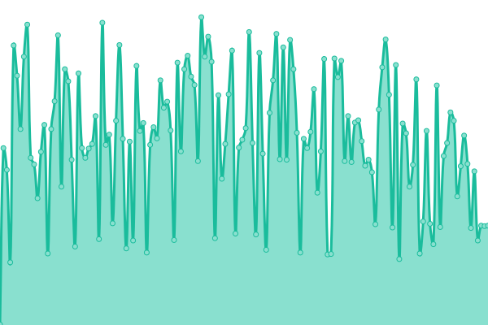
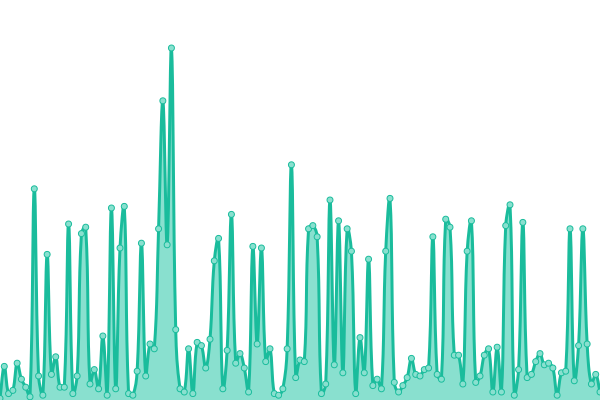
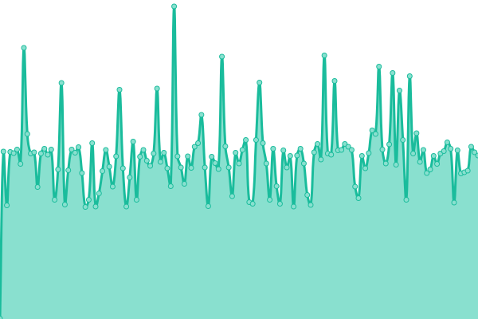
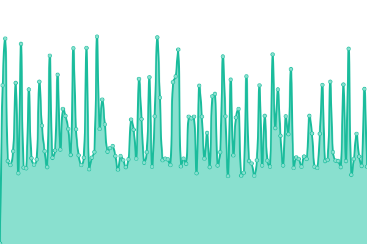
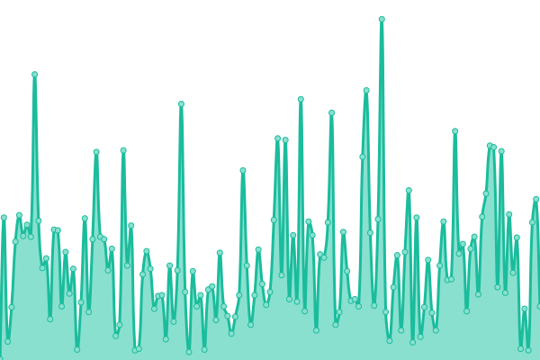
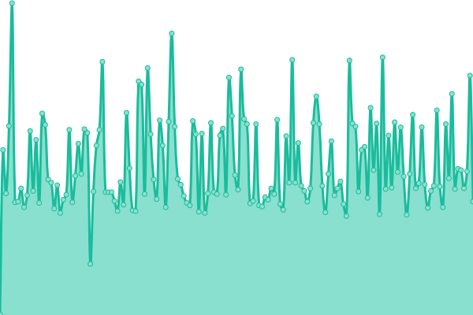
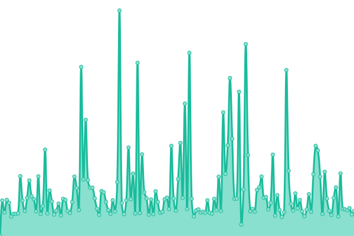
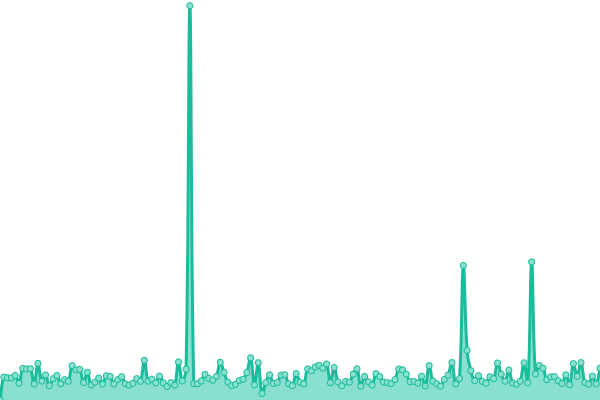

# [📈 Live Status](https://status.yalaso.top): <!--live status--> **🟩 All systems operational**

This repository contains the open-source uptime monitor and status page for [RealYalaSo](https://status.yalaso.top), powered by [Upptime](https://github.com/upptime/upptime).

With [Upptime](https://upptime.js.org), you can get your own unlimited and free uptime monitor and status page, powered entirely by a GitHub repository. We use [Issues](https://github.com/RealYalaSo/status/issues) as incident reports, [Actions](https://github.com/RealYalaSo/status/actions) as uptime monitors, and [Pages](https://status.yalaso.top) for the status page.

<!--start: status pages-->
<!-- This summary is generated by Upptime (https://github.com/upptime/upptime) -->
<!-- Do not edit this manually, your changes will be overwritten -->
<!-- prettier-ignore -->
| URL | Status | History | Response Time | Uptime |
| --- | ------ | ------- | ------------- | ------ |
|  [Yalaso Tech - Home page](https://yalaso.top) | 🟩 Up | [yalaso-tech-home-page.yml](https://github.com/superrr-vpn/status/commits/HEAD/history/yalaso-tech-home-page.yml) | 

 217ms
     
 | 

<a href="https://status.yalaso.top/history/yalaso-tech-home-page">100.00%</a>
    

|  [Turbo Max - Home page old](https://superrr-vpn.yalaso.top) | 🟩 Up | [turbo-max-home-page-old.yml](https://github.com/superrr-vpn/status/commits/HEAD/history/turbo-max-home-page-old.yml) | 

 366ms
     
 | 

<a href="https://status.yalaso.top/history/turbo-max-home-page-old">100.00%</a>
    

|  [Turbo Max - Home page](https://turbo-max.yalaso.top) | 🟩 Up | [turbo-max-home-page.yml](https://github.com/superrr-vpn/status/commits/HEAD/history/turbo-max-home-page.yml) | 

 6ms
     
 | 

<a href="https://status.yalaso.top/history/turbo-max-home-page">100.00%</a>
    

|  [Turbo Max - Subscription](https://turbo-max.yalaso.top/subscriptions.html) | 🟩 Up | [turbo-max-subscription.yml](https://github.com/superrr-vpn/status/commits/HEAD/history/turbo-max-subscription.yml) | 

 47ms
     
 | 

<a href="https://status.yalaso.top/history/turbo-max-subscription">100.00%</a>
    

|  [Turbo Max - Sign in](https://turbo-max.yalaso.top/signin.html) | 🟩 Up | [turbo-max-sign-in.yml](https://github.com/superrr-vpn/status/commits/HEAD/history/turbo-max-sign-in.yml) | 

 0ms
     
 | 

<a href="https://status.yalaso.top/history/turbo-max-sign-in">100.00%</a>
    

|  [Turbo Max - Terms](https://turbo-max.yalaso.top/terms_of_service.html) | 🟩 Up | [turbo-max-terms.yml](https://github.com/superrr-vpn/status/commits/HEAD/history/turbo-max-terms.yml) | 

 46ms
     
 | 

<a href="https://status.yalaso.top/history/turbo-max-terms">100.00%</a>
    

|  [Turbo Max - Policy](https://turbo-max.yalaso.top/policy.html) | 🟩 Up | [turbo-max-policy.yml](https://github.com/superrr-vpn/status/commits/HEAD/history/turbo-max-policy.yml) | 

 44ms
     
 | 

<a href="https://status.yalaso.top/history/turbo-max-policy">100.00%</a>
    

|  [API](https://api.yalaso.top/api/v1/ping) | 🟩 Up | [api.yml](https://github.com/superrr-vpn/status/commits/HEAD/history/api.yml) | 

 930ms
     
 | 

<a href="https://status.yalaso.top/history/api">100.00%</a>
    

|  [API Auth](https://api.yalaso.top/api/v1/host/auth) | 🟩 Up | [api-auth.yml](https://github.com/superrr-vpn/status/commits/HEAD/history/api-auth.yml) | 

 218ms
     
 | 

<a href="https://status.yalaso.top/history/api-auth">100.00%</a>
    

|  [Node - sg-8ba2360b.yalaso.top](http://sg-8ba2360b.yalaso.top/api/v1/ping) | 🟩 Up | [node-sg-8ba2360b-yalaso-top.yml](https://github.com/superrr-vpn/status/commits/HEAD/history/node-sg-8ba2360b-yalaso-top.yml) | 

 499ms
     
 | 

<a href="https://status.yalaso.top/history/node-sg-8ba2360b-yalaso-top">100.00%</a>
    

|  [Node - us-aabb97b2.yalaso.top](http://us-aabb97b2.yalaso.top/api/v1/ping) | 🟩 Up | [node-us-aabb97b2-yalaso-top.yml](https://github.com/superrr-vpn/status/commits/HEAD/history/node-us-aabb97b2-yalaso-top.yml) | 

 145ms
     
 | 

<a href="https://status.yalaso.top/history/node-us-aabb97b2-yalaso-top">100.00%</a>
    

|  [Node - au-ac69bc5e.yalaso.top](http://au-ac69bc5e.yalaso.top/api/v1/ping) | 🟩 Up | [node-au-ac69bc5e-yalaso-top.yml](https://github.com/superrr-vpn/status/commits/HEAD/history/node-au-ac69bc5e-yalaso-top.yml) | 

 413ms
     
 | 

<a href="https://status.yalaso.top/history/node-au-ac69bc5e-yalaso-top">100.00%</a>
    

|  [Node - us-ace99aa8.yalaso.top](http://us-ace99aa8.yalaso.top/api/v1/ping) | 🟩 Up | [node-us-ace99aa8-yalaso-top.yml](https://github.com/superrr-vpn/status/commits/HEAD/history/node-us-ace99aa8-yalaso-top.yml) | 

 161ms
     
 | 

<a href="https://status.yalaso.top/history/node-us-ace99aa8-yalaso-top">100.00%</a>
    

|  [Node - nl-ace93e8a.yalaso.top](http://nl-ace93e8a.yalaso.top/api/v1/ping) | 🟩 Up | [node-nl-ace93e8a-yalaso-top.yml](https://github.com/superrr-vpn/status/commits/HEAD/history/node-nl-ace93e8a-yalaso-top.yml) | 

 267ms
     
 | 

<a href="https://status.yalaso.top/history/node-nl-ace93e8a-yalaso-top">100.00%</a>
    

|  [Node - us-acea110f.yalaso.top](http://us-acea110f.yalaso.top/api/v1/ping) | 🟩 Up | [node-us-acea110f-yalaso-top.yml](https://github.com/superrr-vpn/status/commits/HEAD/history/node-us-acea110f-yalaso-top.yml) | 

 145ms
     
 | 

<a href="https://status.yalaso.top/history/node-us-acea110f-yalaso-top">100.00%</a>
    

|  [Node - ru-0238b28e.yalaso.top](http://ru-0238b28e.yalaso.top/api/v1/ping) | 🟩 Up | [node-ru-0238b28e-yalaso-top.yml](https://github.com/superrr-vpn/status/commits/HEAD/history/node-ru-0238b28e-yalaso-top.yml) | 

 346ms
     
 | 

<a href="https://status.yalaso.top/history/node-ru-0238b28e-yalaso-top">98.63%</a>
    

|  [Node - ru-0238b28f.yalaso.top](http://ru-0238b28f.yalaso.top/api/v1/ping) | 🟩 Up | [node-ru-0238b28f-yalaso-top.yml](https://github.com/superrr-vpn/status/commits/HEAD/history/node-ru-0238b28f-yalaso-top.yml) | 

 339ms
     
 | 

<a href="https://status.yalaso.top/history/node-ru-0238b28f-yalaso-top">98.64%</a>
    

|  [Node - gb-0238b399.yalaso.top](http://gb-0238b399.yalaso.top/api/v1/ping) | 🟩 Up | [node-gb-0238b399-yalaso-top.yml](https://github.com/superrr-vpn/status/commits/HEAD/history/node-gb-0238b399-yalaso-top.yml) | 

 283ms
     
 | 

<a href="https://status.yalaso.top/history/node-gb-0238b399-yalaso-top">99.77%</a>
    

|  [Node - us-25092317.yalaso.top](http://us-25092317.yalaso.top/api/v1/ping) | 🟩 Up | [node-us-25092317-yalaso-top.yml](https://github.com/superrr-vpn/status/commits/HEAD/history/node-us-25092317-yalaso-top.yml) | 

 105ms
     
 | 

<a href="https://status.yalaso.top/history/node-us-25092317-yalaso-top">100.00%</a>
    

|  [Node - ru-2d8102a9.yalaso.top](http://ru-2d8102a9.yalaso.top/api/v1/ping) | 🟩 Up | [node-ru-2d8102a9-yalaso-top.yml](https://github.com/superrr-vpn/status/commits/HEAD/history/node-ru-2d8102a9-yalaso-top.yml) | 

 350ms
     
 | 

<a href="https://status.yalaso.top/history/node-ru-2d8102a9-yalaso-top">100.00%</a>
    

|  [Node - us-2d9641b8.yalaso.top](http://us-2d9641b8.yalaso.top/api/v1/ping) | 🟩 Up | [node-us-2d9641b8-yalaso-top.yml](https://github.com/superrr-vpn/status/commits/HEAD/history/node-us-2d9641b8-yalaso-top.yml) | 

 107ms
     
 | 

<a href="https://status.yalaso.top/history/node-us-2d9641b8-yalaso-top">100.00%</a>
    

|  [Node - us-2d538c95.yalaso.top](http://us-2d538c95.yalaso.top/api/v1/ping) | 🟩 Up | [node-us-2d538c95-yalaso-top.yml](https://github.com/superrr-vpn/status/commits/HEAD/history/node-us-2d538c95-yalaso-top.yml) | 

 201ms
     
 | 

<a href="https://status.yalaso.top/history/node-us-2d538c95-yalaso-top">99.71%</a>
    

|  [Node - jp-2d596d23.yalaso.top](http://jp-2d596d23.yalaso.top/api/v1/ping) | 🟩 Up | [node-jp-2d596d23-yalaso-top.yml](https://github.com/superrr-vpn/status/commits/HEAD/history/node-jp-2d596d23-yalaso-top.yml) | 

 342ms
     
 | 

<a href="https://status.yalaso.top/history/node-jp-2d596d23-yalaso-top">100.00%</a>
    

|  [Node - jp-2d596d24.yalaso.top](http://jp-2d596d24.yalaso.top/api/v1/ping) | 🟩 Up | [node-jp-2d596d24-yalaso-top.yml](https://github.com/superrr-vpn/status/commits/HEAD/history/node-jp-2d596d24-yalaso-top.yml) | 

 333ms
     
 | 

<a href="https://status.yalaso.top/history/node-jp-2d596d24-yalaso-top">100.00%</a>
    

|  [Node - gb-2d596f1f.yalaso.top](http://gb-2d596f1f.yalaso.top/api/v1/ping) | 🟩 Up | [node-gb-2d596f1f-yalaso-top.yml](https://github.com/superrr-vpn/status/commits/HEAD/history/node-gb-2d596f1f-yalaso-top.yml) | 

 238ms
     
 | 

<a href="https://status.yalaso.top/history/node-gb-2d596f1f-yalaso-top">100.00%</a>
    

|  [Node - gb-05082110.yalaso.top](http://gb-05082110.yalaso.top/api/v1/ping) | 🟩 Up | [node-gb-05082110-yalaso-top.yml](https://github.com/superrr-vpn/status/commits/HEAD/history/node-gb-05082110-yalaso-top.yml) | 

 228ms
     
 | 

<a href="https://status.yalaso.top/history/node-gb-05082110-yalaso-top">100.00%</a>
    

|  [Node - gb-05082132.yalaso.top](http://gb-05082132.yalaso.top/api/v1/ping) | 🟩 Up | [node-gb-05082132-yalaso-top.yml](https://github.com/superrr-vpn/status/commits/HEAD/history/node-gb-05082132-yalaso-top.yml) | 

 309ms
     
 | 

<a href="https://status.yalaso.top/history/node-gb-05082132-yalaso-top">100.00%</a>
    

|  [Node - us-480eb83f.yalaso.top](http://us-480eb83f.yalaso.top/api/v1/ping) | 🟩 Up | [node-us-480eb83f-yalaso-top.yml](https://github.com/superrr-vpn/status/commits/HEAD/history/node-us-480eb83f-yalaso-top.yml) | 

 99ms
     
 | 

<a href="https://status.yalaso.top/history/node-us-480eb83f-yalaso-top">99.84%</a>
    

|  [Node - ca-55d06cf7.yalaso.top](http://ca-55d06cf7.yalaso.top/api/v1/ping) | 🟩 Up | [node-ca-55d06cf7-yalaso-top.yml](https://github.com/superrr-vpn/status/commits/HEAD/history/node-ca-55d06cf7-yalaso-top.yml) | 

 92ms
     
 | 

<a href="https://status.yalaso.top/history/node-ca-55d06cf7-yalaso-top">100.00%</a>
    

|  [Node - ca-55d06cfe.yalaso.top](http://ca-55d06cfe.yalaso.top/api/v1/ping) | 🟩 Up | [node-ca-55d06cfe-yalaso-top.yml](https://github.com/superrr-vpn/status/commits/HEAD/history/node-ca-55d06cfe-yalaso-top.yml) | 

 83ms
     
 | 

<a href="https://status.yalaso.top/history/node-ca-55d06cfe-yalaso-top">100.00%</a>
    

|  [Node - fr-555ad8aa.yalaso.top](http://fr-555ad8aa.yalaso.top/api/v1/ping) | 🟩 Up | [node-fr-555ad8aa-yalaso-top.yml](https://github.com/superrr-vpn/status/commits/HEAD/history/node-fr-555ad8aa-yalaso-top.yml) | 

 258ms
     
 | 

<a href="https://status.yalaso.top/history/node-fr-555ad8aa-yalaso-top">37.71%</a>
    

|  [Node - de-592cc6ef.yalaso.top](http://de-592cc6ef.yalaso.top/api/v1/ping) | 🟩 Up | [node-de-592cc6ef-yalaso-top.yml](https://github.com/superrr-vpn/status/commits/HEAD/history/node-de-592cc6ef-yalaso-top.yml) | 

 255ms
     
 | 

<a href="https://status.yalaso.top/history/node-de-592cc6ef-yalaso-top">0.00%</a>
    

|  [Node - us-5cdf1ea7.yalaso.top](http://us-5cdf1ea7.yalaso.top/api/v1/ping) | 🟩 Up | [node-us-5cdf1ea7-yalaso-top.yml](https://github.com/superrr-vpn/status/commits/HEAD/history/node-us-5cdf1ea7-yalaso-top.yml) | 

 113ms
     
 | 

<a href="https://status.yalaso.top/history/node-us-5cdf1ea7-yalaso-top">98.54%</a>
    

|  [Node - fr-5ee8f743.yalaso.top](http://fr-5ee8f743.yalaso.top/api/v1/ping) | 🟩 Up | [node-fr-5ee8f743-yalaso-top.yml](https://github.com/superrr-vpn/status/commits/HEAD/history/node-fr-5ee8f743-yalaso-top.yml) | 

 236ms
     
 | 

<a href="https://status.yalaso.top/history/node-fr-5ee8f743-yalaso-top">100.00%</a>
    

|  [Node - fr-5ee8f748.yalaso.top](http://fr-5ee8f748.yalaso.top/api/v1/ping) | 🟩 Up | [node-fr-5ee8f748-yalaso-top.yml](https://github.com/superrr-vpn/status/commits/HEAD/history/node-fr-5ee8f748-yalaso-top.yml) | 

 262ms
     
 | 

<a href="https://status.yalaso.top/history/node-fr-5ee8f748-yalaso-top">99.82%</a>
    

|  [Node - de-5fa44465.yalaso.top](http://de-5fa44465.yalaso.top/api/v1/ping) | 🟩 Up | [node-de-5fa44465-yalaso-top.yml](https://github.com/superrr-vpn/status/commits/HEAD/history/node-de-5fa44465-yalaso-top.yml) | 

 267ms
     
 | 

<a href="https://status.yalaso.top/history/node-de-5fa44465-yalaso-top">21.25%</a>
    

|  [Node - de-5fa4447d.yalaso.top](http://de-5fa4447d.yalaso.top/api/v1/ping) | 🟩 Up | [node-de-5fa4447d-yalaso-top.yml](https://github.com/superrr-vpn/status/commits/HEAD/history/node-de-5fa4447d-yalaso-top.yml) | 

 260ms
     
 | 

<a href="https://status.yalaso.top/history/node-de-5fa4447d-yalaso-top">21.25%</a>
    

<!--end: status pages-->

[**Visit our status website →**](https://status.yalaso.top)

## 📄 License

- Powered by: [Upptime](https://github.com/upptime/upptime)
- Code: [MIT](./LICENSE) © [RealYalaSo](https://status.yalaso.top)
- Data in the `./history` directory: [Open Database License](https://opendatacommons.org/licenses/odbl/1-0/)
