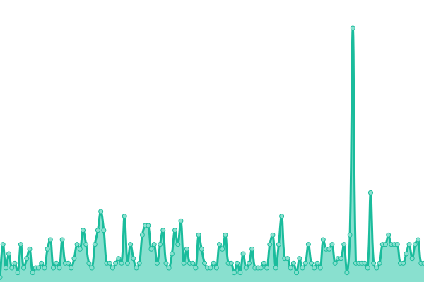
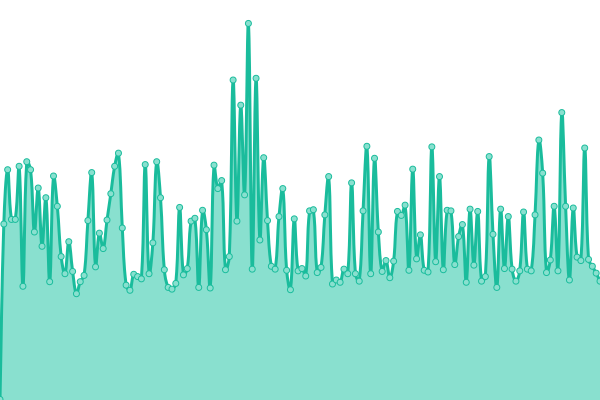
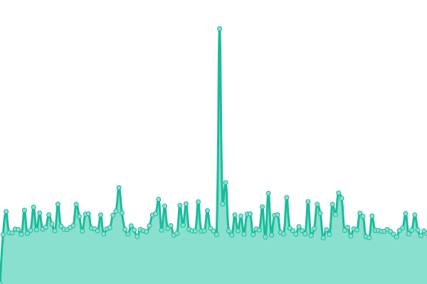
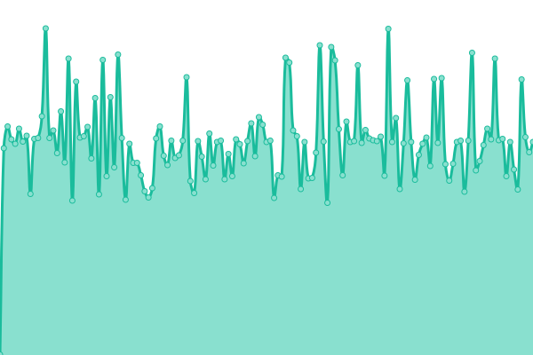
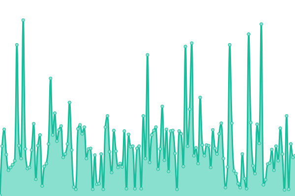
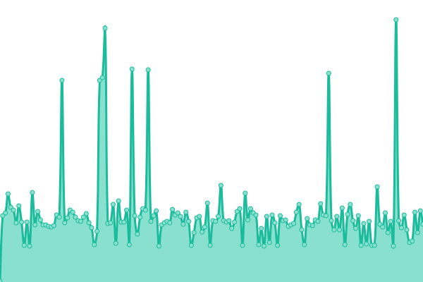
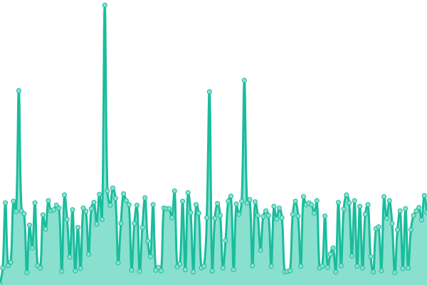
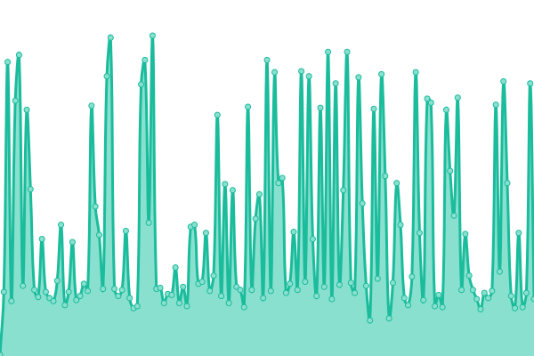
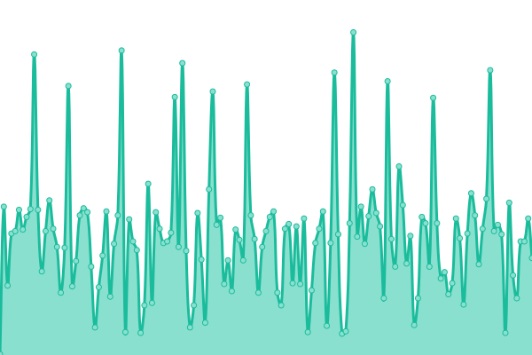

# [📈 Live Status](https://status.yalaso.top): <!--live status--> **🟩 All systems operational**

This repository contains the open-source uptime monitor and status page for [RealYalaSo](https://status.yalaso.top), powered by [Upptime](https://github.com/upptime/upptime).

With [Upptime](https://upptime.js.org), you can get your own unlimited and free uptime monitor and status page, powered entirely by a GitHub repository. We use [Issues](https://github.com/RealYalaSo/status/issues) as incident reports, [Actions](https://github.com/RealYalaSo/status/actions) as uptime monitors, and [Pages](https://status.yalaso.top) for the status page.

<!--start: status pages-->
<!-- This summary is generated by Upptime (https://github.com/upptime/upptime) -->
<!-- Do not edit this manually, your changes will be overwritten -->
<!-- prettier-ignore -->
| URL | Status | History | Response Time | Uptime |
| --- | ------ | ------- | ------------- | ------ |
|  [Yalaso Tech - Home page](https://yalaso.top) | 🟩 Up | [yalaso-tech-home-page.yml](https://github.com/superrr-vpn/status/commits/HEAD/history/yalaso-tech-home-page.yml) | 

 311ms
     
 | 

<a href="https://status.yalaso.top/history/yalaso-tech-home-page">100.00%</a>
    

|  [Turbo Max - Home page old](https://superrr-vpn.yalaso.top) | 🟩 Up | [turbo-max-home-page-old.yml](https://github.com/superrr-vpn/status/commits/HEAD/history/turbo-max-home-page-old.yml) | 

 544ms
     
 | 

<a href="https://status.yalaso.top/history/turbo-max-home-page-old">100.00%</a>
    

|  [Turbo Max - Home page](https://turbo-max.yalaso.top) | 🟩 Up | [turbo-max-home-page.yml](https://github.com/superrr-vpn/status/commits/HEAD/history/turbo-max-home-page.yml) | 

 5ms
     
 | 

<a href="https://status.yalaso.top/history/turbo-max-home-page">100.00%</a>
    

|  [Turbo Max - Subscription](https://turbo-max.yalaso.top/subscriptions.html) | 🟩 Up | [turbo-max-subscription.yml](https://github.com/superrr-vpn/status/commits/HEAD/history/turbo-max-subscription.yml) | 

 56ms
     
 | 

<a href="https://status.yalaso.top/history/turbo-max-subscription">100.00%</a>
    

|  [Turbo Max - Sign in](https://turbo-max.yalaso.top/signin.html) | 🟩 Up | [turbo-max-sign-in.yml](https://github.com/superrr-vpn/status/commits/HEAD/history/turbo-max-sign-in.yml) | 

 0ms
     
 | 

<a href="https://status.yalaso.top/history/turbo-max-sign-in">100.00%</a>
    

|  [Turbo Max - Terms](https://turbo-max.yalaso.top/terms_of_service.html) | 🟩 Up | [turbo-max-terms.yml](https://github.com/superrr-vpn/status/commits/HEAD/history/turbo-max-terms.yml) | 

 52ms
     
 | 

<a href="https://status.yalaso.top/history/turbo-max-terms">100.00%</a>
    

|  [Turbo Max - Policy](https://turbo-max.yalaso.top/policy.html) | 🟩 Up | [turbo-max-policy.yml](https://github.com/superrr-vpn/status/commits/HEAD/history/turbo-max-policy.yml) | 

 52ms
     
 | 

<a href="https://status.yalaso.top/history/turbo-max-policy">100.00%</a>
    

|  [API](https://api.yalaso.top/api/v1/ping) | 🟩 Up | [api.yml](https://github.com/superrr-vpn/status/commits/HEAD/history/api.yml) | 

 1008ms
     
 | 

<a href="https://status.yalaso.top/history/api">100.00%</a>
    

|  [API Auth](https://api.yalaso.top/api/v1/host/auth) | 🟩 Up | [api-auth.yml](https://github.com/superrr-vpn/status/commits/HEAD/history/api-auth.yml) | 

 208ms
     
 | 

<a href="https://status.yalaso.top/history/api-auth">100.00%</a>
    

|  [Node - au-ac69bc5e.yalaso.top](http://au-ac69bc5e.yalaso.top/api/v1/ping) | 🟩 Up | [node-au-ac69bc5e-yalaso-top.yml](https://github.com/superrr-vpn/status/commits/HEAD/history/node-au-ac69bc5e-yalaso-top.yml) | 

 491ms
     
 | 

<a href="https://status.yalaso.top/history/node-au-ac69bc5e-yalaso-top">44.58%</a>
    

|  [Node - ca-55d06c9f.yalaso.top](http://ca-55d06c9f.yalaso.top/api/v1/ping) | 🟩 Up | [node-ca-55d06c9f-yalaso-top.yml](https://github.com/superrr-vpn/status/commits/HEAD/history/node-ca-55d06c9f-yalaso-top.yml) | 

 211ms
     
 | 

<a href="https://status.yalaso.top/history/node-ca-55d06c9f-yalaso-top">44.58%</a>
    

|  [Node - de-25dd7d77.yalaso.top](http://de-25dd7d77.yalaso.top/api/v1/ping) | 🟩 Up | [node-de-25dd7d77-yalaso-top.yml](https://github.com/superrr-vpn/status/commits/HEAD/history/node-de-25dd7d77-yalaso-top.yml) | 

 535ms
     
 | 

<a href="https://status.yalaso.top/history/node-de-25dd7d77-yalaso-top">98.40%</a>
    

|  [Node - de-25dd7d7e.yalaso.top](http://de-25dd7d7e.yalaso.top/api/v1/ping) | 🟩 Up | [node-de-25dd7d7e-yalaso-top.yml](https://github.com/superrr-vpn/status/commits/HEAD/history/node-de-25dd7d7e-yalaso-top.yml) | 

 477ms
     
 | 

<a href="https://status.yalaso.top/history/node-de-25dd7d7e-yalaso-top">98.65%</a>
    

|  [Node - de-592cc6ef.yalaso.top](http://de-592cc6ef.yalaso.top/api/v1/ping) | 🟩 Up | [node-de-592cc6ef-yalaso-top.yml](https://github.com/superrr-vpn/status/commits/HEAD/history/node-de-592cc6ef-yalaso-top.yml) | 

 352ms
     
 | 

<a href="https://status.yalaso.top/history/node-de-592cc6ef-yalaso-top">100.00%</a>
    

|  [Node - fr-555ad8aa.yalaso.top](http://fr-555ad8aa.yalaso.top/api/v1/ping) | 🟩 Up | [node-fr-555ad8aa-yalaso-top.yml](https://github.com/superrr-vpn/status/commits/HEAD/history/node-fr-555ad8aa-yalaso-top.yml) | 

 313ms
     
 | 

<a href="https://status.yalaso.top/history/node-fr-555ad8aa-yalaso-top">100.00%</a>
    

|  [Node - fr-56684abe.yalaso.top](http://fr-56684abe.yalaso.top/api/v1/ping) | 🟩 Up | [node-fr-56684abe-yalaso-top.yml](https://github.com/superrr-vpn/status/commits/HEAD/history/node-fr-56684abe-yalaso-top.yml) | 

 309ms
     
 | 

<a href="https://status.yalaso.top/history/node-fr-56684abe-yalaso-top">44.57%</a>
    

|  [Node - fr-56684abf.yalaso.top](http://fr-56684abf.yalaso.top/api/v1/ping) | 🟩 Up | [node-fr-56684abf-yalaso-top.yml](https://github.com/superrr-vpn/status/commits/HEAD/history/node-fr-56684abf-yalaso-top.yml) | 

 325ms
     
 | 

<a href="https://status.yalaso.top/history/node-fr-56684abf-yalaso-top">44.58%</a>
    

|  [Node - gb-05082110.yalaso.top](http://gb-05082110.yalaso.top/api/v1/ping) | 🟩 Up | [node-gb-05082110-yalaso-top.yml](https://github.com/superrr-vpn/status/commits/HEAD/history/node-gb-05082110-yalaso-top.yml) | 

 301ms
     
 | 

<a href="https://status.yalaso.top/history/node-gb-05082110-yalaso-top">100.00%</a>
    

|  [Node - gb-05082132.yalaso.top](http://gb-05082132.yalaso.top/api/v1/ping) | 🟩 Up | [node-gb-05082132-yalaso-top.yml](https://github.com/superrr-vpn/status/commits/HEAD/history/node-gb-05082132-yalaso-top.yml) | 

 325ms
     
 | 

<a href="https://status.yalaso.top/history/node-gb-05082132-yalaso-top">44.57%</a>
    

|  [Node - gb-05b41e7c.yalaso.top](http://gb-05b41e7c.yalaso.top/api/v1/ping) | 🟩 Up | [node-gb-05b41e7c-yalaso-top.yml](https://github.com/superrr-vpn/status/commits/HEAD/history/node-gb-05b41e7c-yalaso-top.yml) | 

 304ms
     
 | 

<a href="https://status.yalaso.top/history/node-gb-05b41e7c-yalaso-top">44.58%</a>
    

|  [Node - gb-05b41e7d.yalaso.top](http://gb-05b41e7d.yalaso.top/api/v1/ping) | 🟩 Up | [node-gb-05b41e7d-yalaso-top.yml](https://github.com/superrr-vpn/status/commits/HEAD/history/node-gb-05b41e7d-yalaso-top.yml) | 

 285ms
     
 | 

<a href="https://status.yalaso.top/history/node-gb-05b41e7d-yalaso-top">44.58%</a>
    

|  [Node - jp-05fd29e8.yalaso.top](http://jp-05fd29e8.yalaso.top/api/v1/ping) | 🟩 Up | [node-jp-05fd29e8-yalaso-top.yml](https://github.com/superrr-vpn/status/commits/HEAD/history/node-jp-05fd29e8-yalaso-top.yml) | 

 342ms
     
 | 

<a href="https://status.yalaso.top/history/node-jp-05fd29e8-yalaso-top">44.58%</a>
    

|  [Node - jp-2d0b011b.yalaso.top](http://jp-2d0b011b.yalaso.top/api/v1/ping) | 🟩 Up | [node-jp-2d0b011b-yalaso-top.yml](https://github.com/superrr-vpn/status/commits/HEAD/history/node-jp-2d0b011b-yalaso-top.yml) | 

 329ms
     
 | 

<a href="https://status.yalaso.top/history/node-jp-2d0b011b-yalaso-top">100.00%</a>
    

|  [Node - jp-ace941ce.yalaso.top](http://jp-ace941ce.yalaso.top/api/v1/ping) | 🟩 Up | [node-jp-ace941ce-yalaso-top.yml](https://github.com/superrr-vpn/status/commits/HEAD/history/node-jp-ace941ce-yalaso-top.yml) | 

 328ms
     
 | 

<a href="https://status.yalaso.top/history/node-jp-ace941ce-yalaso-top">100.00%</a>
    

|  [Node - nl-ace93e8a.yalaso.top](http://nl-ace93e8a.yalaso.top/api/v1/ping) | 🟩 Up | [node-nl-ace93e8a-yalaso-top.yml](https://github.com/superrr-vpn/status/commits/HEAD/history/node-nl-ace93e8a-yalaso-top.yml) | 

 267ms
     
 | 

<a href="https://status.yalaso.top/history/node-nl-ace93e8a-yalaso-top">100.00%</a>
    

|  [Node - ru-2d8102a9.yalaso.top](http://ru-2d8102a9.yalaso.top/api/v1/ping) | 🟩 Up | [node-ru-2d8102a9-yalaso-top.yml](https://github.com/superrr-vpn/status/commits/HEAD/history/node-ru-2d8102a9-yalaso-top.yml) | 

 365ms
     
 | 

<a href="https://status.yalaso.top/history/node-ru-2d8102a9-yalaso-top">100.00%</a>
    

|  [Node - sg-8ba2360b.yalaso.top](http://sg-8ba2360b.yalaso.top/api/v1/ping) | 🟩 Up | [node-sg-8ba2360b-yalaso-top.yml](https://github.com/superrr-vpn/status/commits/HEAD/history/node-sg-8ba2360b-yalaso-top.yml) | 

 443ms
     
 | 

<a href="https://status.yalaso.top/history/node-sg-8ba2360b-yalaso-top">44.58%</a>
    

|  [Node - us-25092317.yalaso.top](http://us-25092317.yalaso.top/api/v1/ping) | 🟩 Up | [node-us-25092317-yalaso-top.yml](https://github.com/superrr-vpn/status/commits/HEAD/history/node-us-25092317-yalaso-top.yml) | 

 106ms
     
 | 

<a href="https://status.yalaso.top/history/node-us-25092317-yalaso-top">44.58%</a>
    

|  [Node - us-2d96416e.yalaso.top](http://us-2d96416e.yalaso.top/api/v1/ping) | 🟩 Up | [node-us-2d96416e-yalaso-top.yml](https://github.com/superrr-vpn/status/commits/HEAD/history/node-us-2d96416e-yalaso-top.yml) | 

 143ms
     
 | 

<a href="https://status.yalaso.top/history/node-us-2d96416e-yalaso-top">44.58%</a>
    

|  [Node - us-2d964170.yalaso.top](http://us-2d964170.yalaso.top/api/v1/ping) | 🟩 Up | [node-us-2d964170-yalaso-top.yml](https://github.com/superrr-vpn/status/commits/HEAD/history/node-us-2d964170-yalaso-top.yml) | 

 148ms
     
 | 

<a href="https://status.yalaso.top/history/node-us-2d964170-yalaso-top">44.58%</a>
    

|  [Node - us-480eb83f.yalaso.top](http://us-480eb83f.yalaso.top/api/v1/ping) | 🟩 Up | [node-us-480eb83f-yalaso-top.yml](https://github.com/superrr-vpn/status/commits/HEAD/history/node-us-480eb83f-yalaso-top.yml) | 

 110ms
     
 | 

<a href="https://status.yalaso.top/history/node-us-480eb83f-yalaso-top">100.00%</a>
    

|  [Node - us-5cdf1ea7.yalaso.top](http://us-5cdf1ea7.yalaso.top/api/v1/ping) | 🟩 Up | [node-us-5cdf1ea7-yalaso-top.yml](https://github.com/superrr-vpn/status/commits/HEAD/history/node-us-5cdf1ea7-yalaso-top.yml) | 

 108ms
     
 | 

<a href="https://status.yalaso.top/history/node-us-5cdf1ea7-yalaso-top">58.72%</a>
    

|  [Node - us-aabb97b2.yalaso.top](http://us-aabb97b2.yalaso.top/api/v1/ping) | 🟩 Up | [node-us-aabb97b2-yalaso-top.yml](https://github.com/superrr-vpn/status/commits/HEAD/history/node-us-aabb97b2-yalaso-top.yml) | 

 108ms
     
 | 

<a href="https://status.yalaso.top/history/node-us-aabb97b2-yalaso-top">0.00%</a>
    

|  [Node - us-ace99aa8.yalaso.top](http://us-ace99aa8.yalaso.top/api/v1/ping) | 🟩 Up | [node-us-ace99aa8-yalaso-top.yml](https://github.com/superrr-vpn/status/commits/HEAD/history/node-us-ace99aa8-yalaso-top.yml) | 

 102ms
     
 | 

<a href="https://status.yalaso.top/history/node-us-ace99aa8-yalaso-top">44.59%</a>
    

|  [Node - us-acea110f.yalaso.top](http://us-acea110f.yalaso.top/api/v1/ping) | 🟩 Up | [node-us-acea110f-yalaso-top.yml](https://github.com/superrr-vpn/status/commits/HEAD/history/node-us-acea110f-yalaso-top.yml) | 

 103ms
     
 | 

<a href="https://status.yalaso.top/history/node-us-acea110f-yalaso-top">100.00%</a>
    

<!--end: status pages-->

[**Visit our status website →**](https://status.yalaso.top)

## 📄 License

- Powered by: [Upptime](https://github.com/upptime/upptime)
- Code: [MIT](./LICENSE) © [RealYalaSo](https://status.yalaso.top)
- Data in the `./history` directory: [Open Database License](https://opendatacommons.org/licenses/odbl/1-0/)
